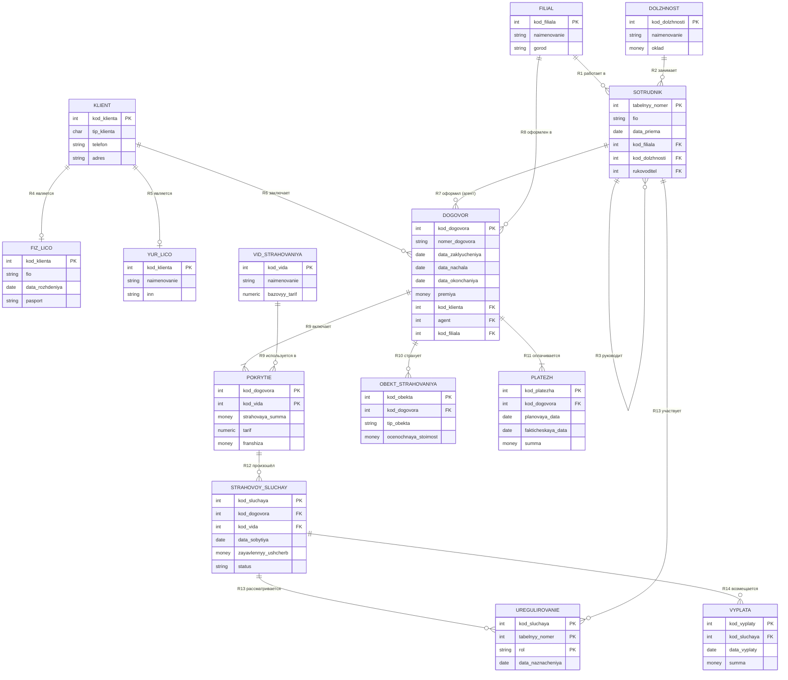
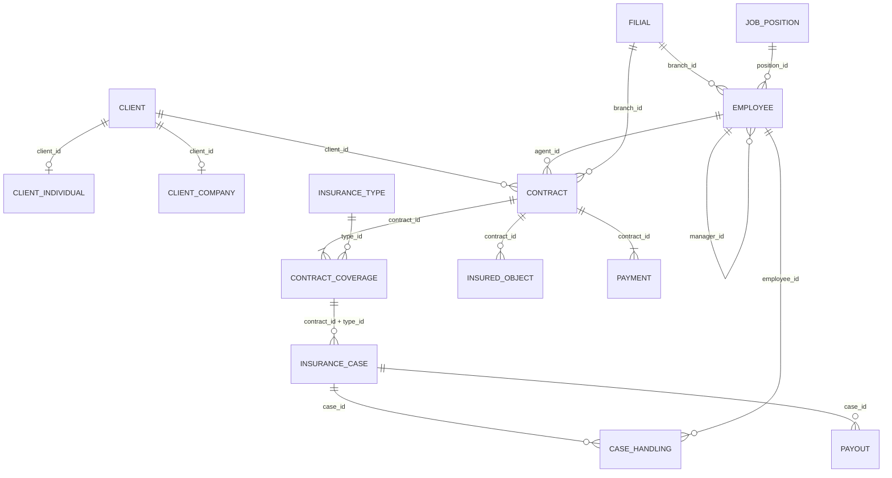

# Контрольная работа по дисциплине «Базы данных»

## Тема: проектирование базы данных «Страховая компания»

**Вопрос 1.** Спроектировать структуру базы данных «Страховая компания», содержащую сведения
о клиентах, сотрудниках и договорах компании.

**Задание 1.** Создать инфологическую модель, описывающую БД в терминах понятий «сущность»,
«набор объектов», «связи сущностей и наборов объектов».

**Задание 2.** Трансформировать инфологическую модель в схему реляционной БД, использующей
понятие отношения; полученная схема используется для заполнения БД информацией — построения
экземпляра БД.

---

## Содержание

1. [Этап проектирования](#1-этап-проектирования)
2. [Задание 1. Инфологическая модель](#2-задание-1-инфологическая-модель)
3. [Задание 2. Схема реляционной БД](#3-задание-2-схема-реляционной-бд)
4. [Нормализация схемы](#4-нормализация-схемы)
5. [Ограничения целостности](#5-ограничения-целостности)
6. [Экземпляр базы данных](#6-экземпляр-базы-данных)
7. [Проверка схемы контрольными запросами](#7-проверка-схемы-контрольными-запросами)
8. [Выводы](#8-выводы)

---

## 1. Этап проектирования

### 1.1. Описание предметной области

Страховая компания имеет сеть **филиалов**. В каждом филиале работают **сотрудники**,
занимающие определённые **должности**; часть сотрудников — страховые агенты, которые
заключают договоры, часть — эксперты и оценщики, участвующие в урегулировании убытков.
У каждого сотрудника, кроме директора, есть непосредственный руководитель — тоже сотрудник
компании.

**Клиентами** компании являются физические и юридические лица. С клиентом заключается
**договор страхования** (полис): он имеет уникальный номер, дату заключения, срок действия,
страховую сумму и страховую премию. Договор заключает конкретный агент от имени конкретного
филиала.

Договор может покрывать **несколько видов страхования** (например, комплексный автополис —
ОСАГО + КАСКО + страхование жизни водителя и пассажиров), причём для каждого вида
в рамках договора указывается своя страховая сумма, свой тариф и своя франшиза.
Один и тот же вид страхования, очевидно, встречается во множестве договоров.

К договору привязаны **объекты страхования** (автомобиль, квартира, оборудование, жизнь
и здоровье застрахованного лица). Страховая премия уплачивается одним или несколькими
**платежами (взносами)** по графику.

В период действия договора может произойти **страховой случай**. Он всегда наступает
по конкретному покрытию договора (например, повреждение автомобиля — по КАСКО, а не по
страхованию жизни), регистрируется,
рассматривается несколькими сотрудниками (эксперт, оценщик, юрист), и по результатам
рассмотрения производятся **выплаты** — одна или несколько.

### 1.2. Границы задачи

В проектируемую БД **включаются**: филиалы, должности, сотрудники, клиенты (с разделением
на физических и юридических лиц), виды страхования, договоры, покрытия по договору,
объекты страхования, платежи, страховые случаи, участие сотрудников в урегулировании,
выплаты.

**Не включаются** (выходит за рамки задачи): бухгалтерский и кадровый учёт (зарплата,
табель, отпуска), перестрахование, документооборот и хранение сканов документов,
маркетинговые данные, права доступа пользователей системы.

### 1.3. Функциональные требования — запросы, которые должна обслуживать БД

| № | Запрос к базе данных |
|---|---|
| Q1 | Все действующие договоры заданного клиента с перечнем видов страхования |
| Q2 | Все договоры, заключённые заданным агентом за период; сумма собранных премий |
| Q3 | Список просроченных платежей по договорам |
| Q4 | Страховые случаи по договору и суммы произведённых по ним выплат |
| Q5 | Убыточность вида страхования: сумма выплат / сумма премий |
| Q6 | Сотрудники филиала с указанием должности и непосредственного руководителя |
| Q7 | Договоры, срок действия которых истекает в ближайшие 30 дней (для пролонгации) |

### 1.4. Бизнес-правила и ограничения предметной области

1. Номер договора уникален в пределах компании.
2. Дата окончания действия договора строго больше даты начала; дата заключения не позже даты начала.
3. Договор заключается ровно с одним клиентом, ровно одним агентом и относится ровно к одному филиалу.
4. Договор должен содержать хотя бы одно покрытие (вид страхования).
5. В рамках одного договора вид страхования может присутствовать только один раз.
6. Клиент — либо физическое, либо юридическое лицо, одновременно не может быть и тем, и другим.
7. ИНН юридического лица уникален; серия+номер паспорта физического лица уникальны.
8. Страховой случай относится к одному договору, и дата события должна попадать в срок действия этого договора.
9. Выплата производится только по страховому случаю, который признан страховым.
10. Суммарная выплата по страховому случаю не должна превышать страховую сумму по соответствующему покрытию.
11. Агентом договора может быть только не уволенный сотрудник компании.
12. Страховая премия и страховые суммы — положительные величины.

---

## 2. Задание 1. Инфологическая модель

Инфологическая (концептуальная) модель строится в терминах модели «сущность — связь»
(ER-модель, П. Чен). Основные понятия:

- **Сущность (entity)** — объект предметной области, о котором в БД хранятся сведения
  (например, конкретный договор № 12-АВ-0001).
- **Набор объектов (тип сущности, entity set)** — множество однотипных сущностей,
  описываемых одним и тем же набором атрибутов (например, все ДОГОВОРЫ).
- **Атрибут** — свойство сущности; **ключ** — атрибут (или набор атрибутов),
  однозначно идентифицирующий сущность в наборе объектов.
- **Связь (relationship)** — ассоциация между наборами объектов, характеризуемая
  **степенью (кардинальностью)** 1:1, 1:М, М:М и **классом принадлежности**
  (обязательный/необязательный).

### 2.1. Наборы объектов (типы сущностей)

| № | Набор объектов | Смысл сущности | Ключ (идентификатор) |
|---|---|---|---|
| E1 | ФИЛИАЛ | Обособленное подразделение компании | Код филиала |
| E2 | ДОЛЖНОСТЬ | Штатная должность | Код должности |
| E3 | СОТРУДНИК | Работник компании (агент, эксперт, руководитель) | Табельный номер |
| E4 | КЛИЕНТ | Страхователь (общая часть сведений) | Код клиента |
| E5 | ФИЗИЧЕСКОЕ ЛИЦО | Специализация клиента — гражданин | Код клиента |
| E6 | ЮРИДИЧЕСКОЕ ЛИЦО | Специализация клиента — организация | Код клиента |
| E7 | ВИД СТРАХОВАНИЯ | Страховой продукт (ОСАГО, КАСКО, ...) | Код вида |
| E8 | ДОГОВОР | Договор страхования (полис) | Код договора |
| E9 | ПОКРЫТИЕ ПО ДОГОВОРУ | Ассоциативная сущность: вид страхования в составе договора | Код договора + код вида |
| E10 | ОБЪЕКТ СТРАХОВАНИЯ | Что застраховано по договору | Код объекта |
| E11 | ПЛАТЁЖ | Страховой взнос по договору | Код платежа |
| E12 | СТРАХОВОЙ СЛУЧАЙ | Заявленное событие, имеющее признаки страхового | Код случая |
| E13 | УРЕГУЛИРОВАНИЕ | Ассоциативная сущность: участие сотрудника в рассмотрении случая | Код случая + табельный номер + роль |
| E14 | ВЫПЛАТА | Страховое возмещение по случаю | Код выплаты |

### 2.2. Атрибуты наборов объектов

Обозначения: **PK** — ключевой атрибут, *курсив* — необязательный (допускает NULL),
`(FK)` — атрибут-связка, появляющийся на этапе перехода к реляционной модели.

**E1. ФИЛИАЛ**: **Код филиала (PK)**, Наименование, Город, Адрес, Телефон, Дата открытия.

**E2. ДОЛЖНОСТЬ**: **Код должности (PK)**, Наименование, Базовый оклад.

**E3. СОТРУДНИК**: **Табельный номер (PK)**, Фамилия, Имя, *Отчество*, Дата рождения,
Серия и номер паспорта (альтернативный ключ), Дата приёма, *Дата увольнения*, *Телефон*,
*E-mail*, Код филиала (FK), Код должности (FK), *Табельный номер руководителя (FK)*.

**E4. КЛИЕНТ**: **Код клиента (PK)**, Тип клиента {Ф — физ. лицо, Ю — юр. лицо},
Дата регистрации, Телефон, *E-mail*, Адрес.

**E5. ФИЗИЧЕСКОЕ ЛИЦО**: **Код клиента (PK, FK)**, Фамилия, Имя, *Отчество*,
Дата рождения, Серия паспорта, Номер паспорта.

**E6. ЮРИДИЧЕСКОЕ ЛИЦО**: **Код клиента (PK, FK)**, Наименование организации, ИНН,
*КПП*, *ОГРН*, ФИО руководителя.

**E7. ВИД СТРАХОВАНИЯ**: **Код вида (PK)**, Наименование, Отрасль страхования
{личное, имущественное, ответственности}, Базовый тариф, *Описание*.

**E8. ДОГОВОР**: **Код договора (PK)**, Номер договора (альтернативный ключ),
Дата заключения, Дата начала действия, Дата окончания действия, Страховая премия,
Статус {действует, завершён, расторгнут}, Код клиента (FK), Табельный номер агента (FK),
Код филиала (FK).

**E9. ПОКРЫТИЕ ПО ДОГОВОРУ**: **Код договора (PK, FK) + Код вида страхования (PK, FK)**,
Страховая сумма, Тариф, *Франшиза*.

**E10. ОБЪЕКТ СТРАХОВАНИЯ**: **Код объекта (PK)**, Код договора (FK), Тип объекта
{ТС, недвижимость, имущество, жизнь и здоровье}, Наименование/описание, Оценочная стоимость,
*Идентификатор объекта* (VIN, кадастровый номер, серийный номер).

**E11. ПЛАТЁЖ**: **Код платежа (PK)**, Код договора (FK), Номер взноса, Плановая дата,
*Фактическая дата*, Сумма, *Способ оплаты* {наличные, карта, безналичный расчёт},
Статус {ожидается, оплачен, просрочен}.

**E12. СТРАХОВОЙ СЛУЧАЙ**: **Код случая (PK)**, Код договора + Код вида страхования (FK
на ПОКРЫТИЕ ПО ДОГОВОРУ), Дата события,
Дата заявления, Описание события, Заявленный ущерб,
Статус {заявлен, на рассмотрении, признан страховым, отказано}.

**E13. УРЕГУЛИРОВАНИЕ**: **Код случая (PK, FK) + Табельный номер (PK, FK) + Роль (PK)**,
Роль {эксперт, оценщик, юрист}, Дата назначения, *Заключение*.

**E14. ВЫПЛАТА**: **Код выплаты (PK)**, Код случая (FK), Дата выплаты, Сумма выплаты,
Номер платёжного документа.

### 2.3. Связи сущностей и наборов объектов

| № | Связь | Наборы объектов | Степень | Класс принадлежности |
|---|---|---|---|---|
| R1 | «работает в» | ФИЛИАЛ — СОТРУДНИК | 1:М | Филиал — необязательный, Сотрудник — обязательный |
| R2 | «занимает» | ДОЛЖНОСТЬ — СОТРУДНИК | 1:М | Должность — необязательный, Сотрудник — обязательный |
| R3 | «руководит» (рекурсивная) | СОТРУДНИК — СОТРУДНИК | 1:М | обе стороны необязательные |
| R4 | «является физ. лицом» | КЛИЕНТ — ФИЗИЧЕСКОЕ ЛИЦО | 1:1 | Клиент — необязательный, Физ. лицо — обязательный |
| R5 | «является юр. лицом» | КЛИЕНТ — ЮРИДИЧЕСКОЕ ЛИЦО | 1:1 | Клиент — необязательный, Юр. лицо — обязательный |
| R6 | «заключает» | КЛИЕНТ — ДОГОВОР | 1:М | Клиент — необязательный, Договор — обязательный |
| R7 | «оформил» | СОТРУДНИК (агент) — ДОГОВОР | 1:М | Сотрудник — необязательный, Договор — обязательный |
| R8 | «оформлен в» | ФИЛИАЛ — ДОГОВОР | 1:М | Филиал — необязательный, Договор — обязательный |
| R9 | «покрывает» | ДОГОВОР — ВИД СТРАХОВАНИЯ | **М:М** (через ПОКРЫТИЕ) | Договор — обязательный (не менее одного покрытия) |
| R10 | «страхует» | ДОГОВОР — ОБЪЕКТ СТРАХОВАНИЯ | 1:М | Договор — необязательный, Объект — обязательный |
| R11 | «оплачивается» | ДОГОВОР — ПЛАТЁЖ | 1:М | Договор — обязательный, Платёж — обязательный |
| R12 | «по покрытию произошёл» | ПОКРЫТИЕ ПО ДОГОВОРУ — СТРАХОВОЙ СЛУЧАЙ | 1:М | Покрытие — необязательное, Случай — обязательный |
| R13 | «урегулирует» | СОТРУДНИК — СТРАХОВОЙ СЛУЧАЙ | **М:М** (через УРЕГУЛИРОВАНИЕ) | обе стороны необязательные |
| R14 | «возмещается» | СТРАХОВОЙ СЛУЧАЙ — ВЫПЛАТА | 1:М | Случай — необязательный, Выплата — обязательная |

Пояснения к неочевидным связям:

- **R3** — рекурсивная связь «начальник — подчинённый» внутри одного набора объектов
  СОТРУДНИК: один сотрудник руководит многими, у каждого сотрудника не более одного
  непосредственного руководителя (у директора руководителя нет — связь необязательная).
- **R4, R5** — **специализация** (иерархия наследования): КЛИЕНТ является родовой сущностью,
  ФИЗИЧЕСКОЕ ЛИЦО и ЮРИДИЧЕСКОЕ ЛИЦО — её подтипы, хранящие взаимоисключающие наборы
  атрибутов. Связь 1:1, причём для каждого клиента существует ровно одна из двух
  дочерних сущностей — это ограничение «полное непересекающееся покрытие».
- **R9** — связь «многие ко многим»: один договор покрывает несколько видов страхования,
  один вид страхования входит во множество договоров. Связь имеет собственные атрибуты
  (страховая сумма, тариф, франшиза), поэтому представлена **ассоциативной сущностью**
  ПОКРЫТИЕ ПО ДОГОВОРУ.
- **R12** — страховой случай связывается не с договором целиком, а с конкретным
  **покрытием** (парой «договор + вид страхования»): это позволяет корректно ограничить
  выплату страховой суммой именно по этому виду страхования и считать убыточность
  в разрезе страховых продуктов. Принадлежность случая договору при этом определяется
  однозначно — через покрытие.
- **R13** — связь «многие ко многим»: один сотрудник участвует в урегулировании многих
  случаев, один случай рассматривается несколькими сотрудниками в разных ролях;
  атрибуты связи — роль, дата назначения, заключение.

### 2.4. ER-диаграмма (инфологическая модель)



Та же модель в текстовой (линейной) нотации — на случай, если диаграмма не отображается:

```
ФИЛИАЛ ──1───М── СОТРУДНИК ──М───1── ДОЛЖНОСТЬ
   │                 │  └──1:М── СОТРУДНИК (руководитель, рекурсия)
   │                 │
   │                 └──1───М── ДОГОВОР ──М───1── КЛИЕНТ ──1:1── ФИЗИЧЕСКОЕ ЛИЦО
   └──1───М───────────────────── ДОГОВОР            └──1:1── ЮРИДИЧЕСКОЕ ЛИЦО
                                    │
        ДОГОВОР ──М───(ПОКРЫТИЕ)───М── ВИД СТРАХОВАНИЯ          [связь М:М]
        ДОГОВОР ──1───М── ОБЪЕКТ СТРАХОВАНИЯ
        ДОГОВОР ──1───М── ПЛАТЁЖ
        ПОКРЫТИЕ ──1───М── СТРАХОВОЙ СЛУЧАЙ ──1───М── ВЫПЛАТА
        СТРАХОВОЙ СЛУЧАЙ ──М───(УРЕГУЛИРОВАНИЕ)───М── СОТРУДНИК  [связь М:М]
```

---

## 3. Задание 2. Схема реляционной БД

### 3.1. Правила перехода от ER-модели к реляционной

При трансформации инфологической модели в схему отношений применены стандартные правила:

1. Каждый **набор объектов** превращается в **отношение (таблицу)**; сущность — в кортеж (строку),
   атрибут — в атрибут отношения (столбец).
2. Ключ набора объектов становится **первичным ключом (PK)** отношения. Для повышения
   устойчивости схемы используются суррогатные ключи-счётчики, а естественные ключи
   (номер договора, ИНН, серия+номер паспорта) объявлены **альтернативными (UNIQUE)**.
3. Связь **1:М** реализуется переносом первичного ключа отношения со стороны «1»
   в отношение со стороны «М» в качестве **внешнего ключа (FK)**.
4. Связь **1:1** реализуется помещением в дочернее отношение внешнего ключа, который
   одновременно является его первичным ключом (PK = FK).
5. Связь **М:М** не может быть выражена напрямую и разрешается введением **связующего
   (ассоциативного) отношения**, первичный ключ которого составной — из внешних ключей
   обеих сторон; собственные атрибуты связи размещаются в этом же отношении.
6. Рекурсивная связь 1:М реализуется внешним ключом, ссылающимся на первичный ключ
   того же отношения.

Итог: 14 наборов объектов → **14 отношений**, из них два (POKRYTIE, UREGULIROVANIE) —
связующие для разрешения связей М:М.

### 3.2. Схема отношений

Обозначения: `PK` — первичный ключ, `FK` — внешний ключ, `AK` — альтернативный ключ (UNIQUE),
`NN` — NOT NULL.

**1. FILIAL** (Филиал)
| Атрибут | Тип | Ключ | Описание |
|---|---|---|---|
| branch_id | SERIAL | PK | Код филиала |
| name | VARCHAR(100) | NN | Наименование |
| city | VARCHAR(60) | NN | Город |
| address | VARCHAR(200) | NN | Адрес |
| phone | VARCHAR(20) | | Телефон |
| open_date | DATE | NN | Дата открытия |

**2. POSITION** (Должность) — в DDL-скрипте таблица названа `job_position`, так как
`POSITION` — зарезервированное слово стандарта SQL
| Атрибут | Тип | Ключ | Описание |
|---|---|---|---|
| position_id | SERIAL | PK | Код должности |
| title | VARCHAR(80) | AK, NN | Наименование должности |
| base_salary | NUMERIC(10,2) | NN | Базовый оклад |

**3. EMPLOYEE** (Сотрудник)
| Атрибут | Тип | Ключ | Описание |
|---|---|---|---|
| employee_id | SERIAL | PK | Табельный номер |
| last_name, first_name | VARCHAR(60) | NN | Фамилия, имя |
| middle_name | VARCHAR(60) | | Отчество |
| birth_date | DATE | NN | Дата рождения |
| passport | CHAR(10) | AK, NN | Серия и номер паспорта |
| hire_date | DATE | NN | Дата приёма |
| dismissal_date | DATE | | Дата увольнения (NULL — работает) |
| phone, email | VARCHAR | | Контакты |
| branch_id | INT | FK → FILIAL | Филиал |
| position_id | INT | FK → POSITION | Должность |
| manager_id | INT | FK → EMPLOYEE | Непосредственный руководитель |

**4. CLIENT** (Клиент)
| Атрибут | Тип | Ключ | Описание |
|---|---|---|---|
| client_id | SERIAL | PK | Код клиента |
| client_type | CHAR(1) | NN | 'F' — физ. лицо, 'J' — юр. лицо |
| reg_date | DATE | NN | Дата регистрации |
| phone | VARCHAR(20) | NN | Телефон |
| email | VARCHAR(80) | | E-mail |
| address | VARCHAR(200) | NN | Адрес |

**5. CLIENT_INDIVIDUAL** (Физическое лицо) — специализация клиента, связь 1:1
| Атрибут | Тип | Ключ | Описание |
|---|---|---|---|
| client_id | INT | PK, FK → CLIENT | Код клиента (PK = FK) |
| last_name, first_name | VARCHAR(60) | NN | Фамилия, имя |
| middle_name | VARCHAR(60) | | Отчество |
| birth_date | DATE | NN | Дата рождения |
| passport_series | CHAR(4) | AK, NN | Серия паспорта |
| passport_number | CHAR(6) | AK, NN | Номер паспорта |

**6. CLIENT_COMPANY** (Юридическое лицо) — специализация клиента, связь 1:1
| Атрибут | Тип | Ключ | Описание |
|---|---|---|---|
| client_id | INT | PK, FK → CLIENT | Код клиента (PK = FK) |
| company_name | VARCHAR(150) | NN | Наименование организации |
| inn | CHAR(10) | AK, NN | ИНН |
| kpp | CHAR(9) | | КПП |
| ogrn | CHAR(13) | | ОГРН |
| director | VARCHAR(120) | NN | ФИО руководителя |

**7. INSURANCE_TYPE** (Вид страхования)
| Атрибут | Тип | Ключ | Описание |
|---|---|---|---|
| type_id | SERIAL | PK | Код вида страхования |
| name | VARCHAR(80) | AK, NN | Наименование (ОСАГО, КАСКО, ...) |
| category | VARCHAR(20) | NN | Отрасль: личное / имущественное / ответственности |
| base_rate | NUMERIC(6,4) | NN | Базовый тариф (доля от страховой суммы) |
| description | TEXT | | Описание продукта |

**8. CONTRACT** (Договор)
| Атрибут | Тип | Ключ | Описание |
|---|---|---|---|
| contract_id | SERIAL | PK | Код договора |
| contract_number | VARCHAR(20) | AK, NN | Номер договора (полиса) |
| sign_date | DATE | NN | Дата заключения |
| start_date | DATE | NN | Дата начала действия |
| end_date | DATE | NN | Дата окончания действия |
| premium | NUMERIC(12,2) | NN | Страховая премия по договору |
| status | VARCHAR(12) | NN | действует / завершён / расторгнут |
| client_id | INT | FK → CLIENT | Страхователь |
| agent_id | INT | FK → EMPLOYEE | Агент, оформивший договор |
| branch_id | INT | FK → FILIAL | Филиал оформления |

**9. CONTRACT_COVERAGE** (Покрытие по договору) — разрешение связи М:М «ДОГОВОР ↔ ВИД СТРАХОВАНИЯ»
| Атрибут | Тип | Ключ | Описание |
|---|---|---|---|
| contract_id | INT | PK, FK → CONTRACT | Договор |
| type_id | INT | PK, FK → INSURANCE_TYPE | Вид страхования |
| insured_sum | NUMERIC(14,2) | NN | Страховая сумма по этому виду |
| rate | NUMERIC(6,4) | NN | Применённый тариф |
| franchise | NUMERIC(12,2) | | Франшиза |

**10. INSURED_OBJECT** (Объект страхования)
| Атрибут | Тип | Ключ | Описание |
|---|---|---|---|
| object_id | SERIAL | PK | Код объекта |
| contract_id | INT | FK → CONTRACT | Договор |
| object_kind | VARCHAR(20) | NN | ТС / недвижимость / имущество / жизнь |
| description | VARCHAR(200) | NN | Описание объекта |
| appraised_value | NUMERIC(14,2) | NN | Оценочная стоимость |
| object_ref | VARCHAR(40) | | VIN, кадастровый или серийный номер |

**11. PAYMENT** (Платёж / страховой взнос)
| Атрибут | Тип | Ключ | Описание |
|---|---|---|---|
| payment_id | SERIAL | PK | Код платежа |
| contract_id | INT | FK → CONTRACT | Договор |
| instalment_no | SMALLINT | AK*, NN | Номер взноса в графике |
| due_date | DATE | NN | Плановая дата |
| paid_date | DATE | | Фактическая дата оплаты |
| amount | NUMERIC(12,2) | NN | Сумма взноса |
| method | VARCHAR(20) | | Способ оплаты |
| status | VARCHAR(12) | NN | ожидается / оплачен / просрочен |

\* альтернативный ключ составной: UNIQUE (contract_id, instalment_no).

**12. INSURANCE_CASE** (Страховой случай)
| Атрибут | Тип | Ключ | Описание |
|---|---|---|---|
| case_id | SERIAL | PK | Код страхового случая |
| contract_id | INT | FK* → CONTRACT_COVERAGE | Договор |
| type_id | INT | FK* → CONTRACT_COVERAGE | Вид страхования, по которому произошёл случай |
| event_date | DATE | NN | Дата события |
| report_date | DATE | NN | Дата заявления |
| description | TEXT | NN | Обстоятельства события |
| claimed_amount | NUMERIC(14,2) | NN | Заявленный ущерб |
| status | VARCHAR(20) | NN | заявлен / на рассмотрении / признан / отказано |

\* внешний ключ составной: (contract_id, type_id) → CONTRACT_COVERAGE (contract_id, type_id).

**13. CASE_HANDLING** (Урегулирование) — разрешение связи М:М «СОТРУДНИК ↔ СТРАХОВОЙ СЛУЧАЙ»
| Атрибут | Тип | Ключ | Описание |
|---|---|---|---|
| case_id | INT | PK, FK → INSURANCE_CASE | Страховой случай |
| employee_id | INT | PK, FK → EMPLOYEE | Сотрудник |
| role | VARCHAR(20) | PK | Роль: эксперт / оценщик / юрист |
| assign_date | DATE | NN | Дата назначения |
| conclusion | TEXT | | Заключение |

**14. PAYOUT** (Выплата)
| Атрибут | Тип | Ключ | Описание |
|---|---|---|---|
| payout_id | SERIAL | PK | Код выплаты |
| case_id | INT | FK → INSURANCE_CASE | Страховой случай |
| payout_date | DATE | NN | Дата выплаты |
| amount | NUMERIC(14,2) | NN | Сумма возмещения |
| doc_number | VARCHAR(20) | NN | Номер платёжного документа |

Компактная запись схемы в виде отношений (подчёркнут первичный ключ, курсив — внешний):

```
FILIAL            (branch_id, name, city, address, phone, open_date)
POSITION          (position_id, title, base_salary)   -- в DDL: job_position
EMPLOYEE          (employee_id, last_name, first_name, middle_name, birth_date, passport,
                   hire_date, dismissal_date, phone, email, branch_id, position_id, manager_id)
CLIENT            (client_id, client_type, reg_date, phone, email, address)
CLIENT_INDIVIDUAL (client_id, last_name, first_name, middle_name, birth_date,
                   passport_series, passport_number)
CLIENT_COMPANY    (client_id, company_name, inn, kpp, ogrn, director)
INSURANCE_TYPE    (type_id, name, category, base_rate, description)
CONTRACT          (contract_id, contract_number, sign_date, start_date, end_date, premium,
                   status, client_id, agent_id, branch_id)
CONTRACT_COVERAGE (contract_id, type_id, insured_sum, rate, franchise)
INSURED_OBJECT    (object_id, contract_id, object_kind, description, appraised_value, object_ref)
PAYMENT           (payment_id, contract_id, instalment_no, due_date, paid_date, amount,
                   method, status)
INSURANCE_CASE    (case_id, contract_id, type_id, event_date, report_date, description,
                   claimed_amount, status)
CASE_HANDLING     (case_id, employee_id, role, assign_date, conclusion)
PAYOUT            (payout_id, case_id, payout_date, amount, doc_number)
```

### 3.3. Связи между таблицами по конкретным полям

Это ключевая часть схемы: каждая связь реализована конкретной парой полей
«внешний ключ → первичный ключ».

| № | Дочерняя таблица.поле (FK) | → | Родительская таблица.поле (PK) | Тип связи | Правило удаления |
|---|---|---|---|---|---|
| FK1 | EMPLOYEE.branch_id | → | FILIAL.branch_id | 1:М | RESTRICT |
| FK2 | EMPLOYEE.position_id | → | POSITION (job_position).position_id | 1:М | RESTRICT |
| FK3 | EMPLOYEE.manager_id | → | EMPLOYEE.employee_id | 1:М (рекурсивная) | SET NULL |
| FK4 | CLIENT_INDIVIDUAL.client_id | → | CLIENT.client_id | 1:1 | CASCADE |
| FK5 | CLIENT_COMPANY.client_id | → | CLIENT.client_id | 1:1 | CASCADE |
| FK6 | CONTRACT.client_id | → | CLIENT.client_id | 1:М | RESTRICT |
| FK7 | CONTRACT.agent_id | → | EMPLOYEE.employee_id | 1:М | RESTRICT |
| FK8 | CONTRACT.branch_id | → | FILIAL.branch_id | 1:М | RESTRICT |
| FK9 | CONTRACT_COVERAGE.contract_id | → | CONTRACT.contract_id | М:М (1-я сторона) | CASCADE |
| FK10 | CONTRACT_COVERAGE.type_id | → | INSURANCE_TYPE.type_id | М:М (2-я сторона) | RESTRICT |
| FK11 | INSURED_OBJECT.contract_id | → | CONTRACT.contract_id | 1:М | CASCADE |
| FK12 | PAYMENT.contract_id | → | CONTRACT.contract_id | 1:М | CASCADE |
| FK13 | INSURANCE_CASE.(contract_id, type_id) | → | CONTRACT_COVERAGE.(contract_id, type_id) | 1:М (составной FK) | RESTRICT |
| FK14 | CASE_HANDLING.case_id | → | INSURANCE_CASE.case_id | М:М (1-я сторона) | CASCADE |
| FK15 | CASE_HANDLING.employee_id | → | EMPLOYEE.employee_id | М:М (2-я сторона) | RESTRICT |
| FK16 | PAYOUT.case_id | → | INSURANCE_CASE.case_id | 1:М | RESTRICT |

### 3.4. Диаграмма схемы реляционной БД



Текстовое представление связей по полям:

```
FILIAL(branch_id) ──< EMPLOYEE(branch_id)
POSITION(position_id) ──< EMPLOYEE(position_id)
EMPLOYEE(employee_id) ──< EMPLOYEE(manager_id)                  [рекурсия]
CLIENT(client_id) ──1:1── CLIENT_INDIVIDUAL(client_id)
CLIENT(client_id) ──1:1── CLIENT_COMPANY(client_id)
CLIENT(client_id) ──< CONTRACT(client_id)
EMPLOYEE(employee_id) ──< CONTRACT(agent_id)
FILIAL(branch_id) ──< CONTRACT(branch_id)
CONTRACT(contract_id) ──< CONTRACT_COVERAGE(contract_id) >── INSURANCE_TYPE(type_id)   [М:М]
CONTRACT(contract_id) ──< INSURED_OBJECT(contract_id)
CONTRACT(contract_id) ──< PAYMENT(contract_id)
CONTRACT_COVERAGE(contract_id, type_id) ──< INSURANCE_CASE(contract_id, type_id)
INSURANCE_CASE(case_id) ──< CASE_HANDLING(case_id) >── EMPLOYEE(employee_id)           [М:М]
INSURANCE_CASE(case_id) ──< PAYOUT(case_id)
```

---

## 4. Нормализация схемы

**Первая нормальная форма (1НФ).** Все атрибуты всех отношений атомарны, повторяющихся
групп нет. Множественные по своей природе сведения вынесены в отдельные отношения:
виды страхования по договору — в CONTRACT_COVERAGE, объекты страхования — в INSURED_OBJECT,
график взносов — в PAYMENT. Строка «ФИО» разделена на фамилию, имя и отчество,
паспорт физического лица — на серию и номер.

**Вторая нормальная форма (2НФ).** Все неключевые атрибуты функционально полно зависят
от первичного ключа. Проверка критична для отношений с составным ключом:

- CONTRACT_COVERAGE (PK = contract_id + type_id): страховая сумма, тариф и франшиза
  зависят именно от пары «договор + вид страхования», а не от одной её части. Наименование
  вида страхования в этом отношении не хранится — оно зависело бы только от `type_id`
  (частичная зависимость) и осталось в INSURANCE_TYPE.
- CASE_HANDLING (PK = case_id + employee_id + role): дата назначения и заключение
  зависят от полного ключа; ФИО сотрудника и обстоятельства случая в связующем отношении
  не дублируются.

**Третья нормальная форма (3НФ).** Транзитивные зависимости неключевых атрибутов устранены:

- в EMPLOYEE не хранятся наименование должности и оклад — иначе возникла бы зависимость
  `employee_id → position_id → title, base_salary`; эти атрибуты вынесены в POSITION;
- в EMPLOYEE не хранятся город и адрес филиала (`employee_id → branch_id → city`) —
  они в FILIAL;
- в CONTRACT не дублируются ФИО/телефон клиента и ФИО агента — только их коды;
- в PAYOUT не хранится номер договора: он определяется через `case_id → contract_id`;
- в INSURANCE_CASE не дублируется страховая сумма покрытия — она доступна по составному
  внешнему ключу `(contract_id, type_id)`.

**Производные (вычисляемые) величины.** Общая страховая сумма договора и фактически
уплаченная сумма не хранятся в CONTRACT, так как вычисляются из CONTRACT_COVERAGE и PAYMENT;
для удобства создаётся представление:

```sql
CREATE VIEW v_contract_totals AS
SELECT c.contract_id,
       c.contract_number,
       SUM(cc.insured_sum)                                  AS total_insured_sum,
       c.premium,
       COALESCE((SELECT SUM(p.amount) FROM payment p
                 WHERE p.contract_id = c.contract_id AND p.status = 'оплачен'), 0) AS paid_amount
FROM contract c
JOIN contract_coverage cc ON cc.contract_id = c.contract_id
GROUP BY c.contract_id, c.contract_number, c.premium;
```

Атрибут `premium` в CONTRACT сохранён намеренно: это юридически зафиксированная
в договоре величина, которая не должна изменяться задним числом при пересмотре тарифов
в справочнике INSURANCE_TYPE (осознанное отступление от «чистой» вычисляемости,
а не нарушение нормальных форм).

Все 14 отношений находятся в **3НФ** (и, поскольку в каждом из них единственный детерминант —
потенциальный ключ, фактически в НФБК).

---

## 5. Ограничения целостности

**Целостность сущностей** — первичный ключ каждого отношения объявлен NOT NULL и уникален.

**Ссылочная целостность** — все 16 внешних ключей из п. 3.3 с правилами
ON DELETE RESTRICT / CASCADE / SET NULL.

**Целостность, определяемая предметной областью** (реализуется ограничениями CHECK,
UNIQUE и триггерами):

| Бизнес-правило (п. 1.4) | Реализация |
|---|---|
| 1. Уникальность номера договора | UNIQUE (contract.contract_number) |
| 2. Корректность дат договора | CHECK (end_date > start_date AND sign_date <= start_date) |
| 5. Вид страхования в договоре не повторяется | PK (contract_id, type_id) в CONTRACT_COVERAGE |
| 6. Клиент — либо физ., либо юр. лицо | CHECK (client_type IN ('F','J')) + триггер, запрещающий одновременное наличие записей в CLIENT_INDIVIDUAL и CLIENT_COMPANY |
| 7. Уникальность ИНН / паспорта | UNIQUE (inn), UNIQUE (passport_series, passport_number) |
| 8. Событие в пределах срока действия | Триггер: event_date BETWEEN start_date AND end_date по связанному договору |
| 9. Выплата только по признанному случаю | Триггер: status = 'признан' у INSURANCE_CASE |
| 10. Выплата не больше страховой суммы | Триггер: SUM(payout.amount) <= coverage.insured_sum по покрытию случая |
| 11. Агент не уволен | Триггер: employee.dismissal_date IS NULL на дату заключения |
| 12. Положительность сумм | CHECK (premium > 0), CHECK (insured_sum > 0), CHECK (amount > 0) |
| 4. Договор содержит хотя бы одно покрытие | Проверяется на уровне транзакции (договор и покрытия вставляются одной транзакцией) |

**Индексы** для поддержки запросов Q1–Q7: по всем внешним ключам, а также
`contract(end_date)`, `contract(sign_date)`, `payment(status, due_date)`,
`insurance_case(event_date)`.

---

## 6. Экземпляр базы данных

Ниже — фрагмент экземпляра БД (заполнение спроектированной схемы информацией).
Полный скрипт заполнения — в файле [`seed.sql`](seed.sql).

**FILIAL**

| branch_id | name | city | address | phone | open_date |
|---|---|---|---|---|---|
| 1 | Головной офис | Москва | ул. Тверская, 12 | +7 495 100-10-10 | 2005-03-01 |
| 2 | Филиал «Северный» | Санкт-Петербург | Невский пр., 84 | +7 812 200-20-20 | 2011-09-15 |

**POSITION**

| position_id | title | base_salary |
|---|---|---|
| 1 | Директор филиала | 180000.00 |
| 2 | Страховой агент | 60000.00 |
| 3 | Эксперт по убыткам | 90000.00 |
| 4 | Юрист | 95000.00 |

**EMPLOYEE**

| employee_id | last_name | first_name | passport | hire_date | branch_id | position_id | manager_id |
|---|---|---|---|---|---|---|---|
| 1 | Фёдоров | Игорь | 4501123456 | 2005-03-01 | 1 | 1 | NULL |
| 2 | Смирнова | Анна | 4502234567 | 2018-06-11 | 1 | 2 | 1 |
| 3 | Кузнецов | Павел | 4003345678 | 2019-02-04 | 2 | 2 | 1 |
| 4 | Волкова | Мария | 4504456789 | 2016-10-20 | 1 | 3 | 1 |
| 5 | Орлов | Дмитрий | 4505567890 | 2020-01-13 | 1 | 4 | 1 |

**CLIENT / CLIENT_INDIVIDUAL / CLIENT_COMPANY**

| client_id | client_type | reg_date | phone | address |
|---|---|---|---|---|
| 1 | F | 2021-04-05 | +7 916 111-22-33 | г. Москва, ул. Лесная, 5-17 |
| 2 | F | 2022-08-19 | +7 921 222-33-44 | г. Санкт-Петербург, пр. Науки, 3-40 |
| 3 | J | 2020-11-30 | +7 495 333-44-55 | г. Москва, Варшавское ш., 1 |

| client_id | last_name | first_name | middle_name | birth_date | passport_series | passport_number |
|---|---|---|---|---|---|---|
| 1 | Иванов | Сергей | Петрович | 1985-07-12 | 4510 | 654321 |
| 2 | Петрова | Ольга | Ивановна | 1992-03-26 | 4012 | 123987 |

| client_id | company_name | inn | kpp | director |
|---|---|---|---|---|
| 3 | ООО «Логистик-Трейд» | 7701234567 | 770101001 | Николаев А. В. |

**INSURANCE_TYPE**

| type_id | name | category | base_rate |
|---|---|---|---|
| 1 | ОСАГО | ответственности | 0.0500 |
| 2 | КАСКО | имущественное | 0.0700 |
| 3 | Страхование жизни и здоровья | личное | 0.0150 |
| 4 | Страхование недвижимости | имущественное | 0.0040 |
| 5 | Страхование грузов | имущественное | 0.0090 |

**CONTRACT**

| contract_id | contract_number | sign_date | start_date | end_date | premium | status | client_id | agent_id | branch_id |
|---|---|---|---|---|---|---|---|---|---|
| 1 | ДС-2025-000101 | 2025-01-15 | 2025-01-16 | 2026-01-15 | 62500.00 | действует | 1 | 2 | 1 |
| 2 | ДС-2025-000102 | 2025-03-02 | 2025-03-03 | 2026-03-02 | 18000.00 | действует | 2 | 3 | 2 |
| 3 | ДС-2025-000103 | 2025-05-20 | 2025-06-01 | 2026-05-31 | 135000.00 | действует | 3 | 2 | 1 |

**CONTRACT_COVERAGE** — разрешённая связь М:М «договор ↔ вид страхования»

| contract_id | type_id | insured_sum | rate | franchise |
|---|---|---|---|---|
| 1 | 1 | 400000.00 | 0.0500 | NULL |
| 1 | 2 | 1200000.00 | 0.0350 | 15000.00 |
| 1 | 3 | 300000.00 | 0.0150 | NULL |
| 2 | 4 | 4500000.00 | 0.0040 | 10000.00 |
| 3 | 5 | 15000000.00 | 0.0090 | 50000.00 |

**INSURED_OBJECT**

| object_id | contract_id | object_kind | description | appraised_value | object_ref |
|---|---|---|---|---|---|
| 1 | 1 | ТС | Kia Rio, 2021 г. в. | 1200000.00 | XWEHN412BM0012345 |
| 2 | 1 | жизнь | Иванов С. П., водитель | 300000.00 | NULL |
| 3 | 2 | недвижимость | Квартира 62 м², пр. Науки, 3-40 | 4500000.00 | 78:36:0005001:1234 |
| 4 | 3 | имущество | Партия бытовой техники | 15000000.00 | НАКЛ-4471 |

**PAYMENT**

| payment_id | contract_id | instalment_no | due_date | paid_date | amount | status |
|---|---|---|---|---|---|---|
| 1 | 1 | 1 | 2025-01-16 | 2025-01-16 | 31250.00 | оплачен |
| 2 | 1 | 2 | 2025-07-16 | 2025-07-14 | 31250.00 | оплачен |
| 3 | 2 | 1 | 2025-03-03 | 2025-03-03 | 18000.00 | оплачен |
| 4 | 3 | 1 | 2025-06-01 | 2025-06-01 | 67500.00 | оплачен |
| 5 | 3 | 2 | 2025-12-01 | NULL | 67500.00 | ожидается |

**INSURANCE_CASE**

| case_id | contract_id | type_id | event_date | report_date | claimed_amount | status |
|---|---|---|---|---|---|---|
| 1 | 1 | 2 (КАСКО) | 2025-04-08 | 2025-04-09 | 145000.00 | признан |
| 2 | 2 | 4 (недвижимость) | 2025-07-22 | 2025-07-23 | 260000.00 | на рассмотрении |

**CASE_HANDLING** — разрешённая связь М:М «сотрудник ↔ страховой случай»

| case_id | employee_id | role | assign_date |
|---|---|---|---|
| 1 | 4 | эксперт | 2025-04-09 |
| 1 | 5 | юрист | 2025-04-10 |
| 2 | 4 | эксперт | 2025-07-23 |

**PAYOUT**

| payout_id | case_id | payout_date | amount | doc_number |
|---|---|---|---|---|
| 1 | 1 | 2025-04-25 | 130000.00 | ПП-00871 |

---

## 7. Проверка схемы контрольными запросами

Схема проверена на функциональных требованиях п. 1.3 — каждый запрос выражается
через объявленные связи по конкретным полям.

**Q1. Действующие договоры клиента с перечнем видов страхования**

```sql
SELECT c.contract_number, c.start_date, c.end_date, it.name, cc.insured_sum
FROM contract c
JOIN contract_coverage cc ON cc.contract_id = c.contract_id
JOIN insurance_type   it ON it.type_id     = cc.type_id
WHERE c.client_id = 1 AND c.status = 'действует';
```

**Q2. Сумма премий, собранных агентом за период**

```sql
SELECT e.last_name, e.first_name, COUNT(*) AS contracts, SUM(c.premium) AS premium_total
FROM contract c
JOIN employee e ON e.employee_id = c.agent_id
WHERE c.sign_date BETWEEN '2025-01-01' AND '2025-12-31'
GROUP BY e.employee_id, e.last_name, e.first_name;
```

**Q3. Просроченные платежи**

```sql
SELECT c.contract_number, p.instalment_no, p.due_date, p.amount
FROM payment p
JOIN contract c ON c.contract_id = p.contract_id
WHERE p.paid_date IS NULL AND p.due_date < CURRENT_DATE;
```

**Q5. Убыточность по видам страхования**

```sql
SELECT it.name,
       SUM(cc.insured_sum * cc.rate)        AS premium_earned,
       COALESCE(SUM(po.amount), 0)          AS payouts,
       ROUND(COALESCE(SUM(po.amount),0) / NULLIF(SUM(cc.insured_sum * cc.rate),0), 3) AS loss_ratio
FROM contract_coverage cc
JOIN insurance_type it ON it.type_id = cc.type_id
LEFT JOIN insurance_case ic ON ic.contract_id = cc.contract_id
                            AND ic.type_id     = cc.type_id
                            AND ic.status      = 'признан'
LEFT JOIN payout po        ON po.case_id     = ic.case_id
GROUP BY it.type_id, it.name;
```

**Q6. Сотрудники филиала с должностью и руководителем**

```sql
SELECT e.last_name, p.title, f.name AS branch, m.last_name AS manager
FROM employee e
JOIN job_position p ON p.position_id = e.position_id
JOIN filial   f ON f.branch_id   = e.branch_id
LEFT JOIN employee m ON m.employee_id = e.manager_id
WHERE e.branch_id = 1 AND e.dismissal_date IS NULL;
```

**Q7. Договоры, истекающие в ближайшие 30 дней**

```sql
SELECT c.contract_number, c.end_date, cl.phone
FROM contract c
JOIN client cl ON cl.client_id = c.client_id
WHERE c.status = 'действует'
  AND c.end_date BETWEEN CURRENT_DATE AND CURRENT_DATE + INTERVAL '30 days';
```

### 7.1. Проверка ограничений целостности

Схема развёрнута в СУБД PostgreSQL 16 (скрипты [`schema.sql`](schema.sql) и [`seed.sql`](seed.sql)
выполнены без ошибок), после чего проверены ограничения предметной области — все
некорректные операции отклонены:

| Проверка | Результат |
|---|---|
| Выплата по непризнанному страховому случаю | ОШИБКА: «Выплата возможна только по признанному страховому случаю (статус: на рассмотрении)» |
| Выплата 2 130 000 руб. при страховой сумме 1 200 000 руб. | ОШИБКА: «Сумма выплат превышает страховую сумму по покрытию» |
| Клиент-физлицо регистрируется ещё и как юрлицо | ОШИБКА: «Клиент 1 уже зарегистрирован как физическое лицо» |
| Страховой случай с датой события вне срока действия договора | ОШИБКА: «Дата события 2024-01-01 вне срока действия договора (2025-01-16 .. 2026-01-15)» |
| Повторное добавление вида страхования в тот же договор | ОШИБКА: нарушение первичного ключа contract_coverage_pkey, Key (contract_id, type_id)=(1, 2) |

Результат запроса Q5 на экземпляре БД из п. 6:

| Вид страхования | Начисленная премия | Выплаты | Убыточность |
|---|---|---|---|
| ОСАГО | 20 000.00 | 0.00 | 0.000 |
| КАСКО | 42 000.00 | 130 000.00 | 3.095 |
| Страхование жизни и здоровья | 4 500.00 | 0.00 | 0.000 |
| Страхование недвижимости | 18 000.00 | 0.00 | 0.000 |
| Страхование грузов | 135 000.00 | 0.00 | 0.000 |

---

## 8. Выводы

1. Выполнен **этап проектирования**: описана предметная область «Страховая компания»,
   определены границы задачи, сформулированы функциональные требования (7 типовых запросов)
   и 12 бизнес-правил, ограничивающих данные.
2. **Задание 1** — построена инфологическая модель в терминах ER-модели: выделено
   **14 наборов объектов** с полным перечнем атрибутов и ключей и **14 связей** с указанием
   степени и класса принадлежности, в том числе две связи **М:М** (договор ↔ вид страхования,
   сотрудник ↔ страховой случай), две связи **1:1** (специализация клиента на физическое
   и юридическое лицо) и одна **рекурсивная** связь (руководитель — подчинённый).
3. **Задание 2** — инфологическая модель трансформирована в схему реляционной БД
   из **14 отношений**: связи 1:М реализованы переносом ключа, связи 1:1 — совпадением
   PK и FK дочернего отношения, связи М:М разрешены двумя связующими отношениями
   CONTRACT_COVERAGE и CASE_HANDLING с составными первичными ключами. Все связи
   между таблицами заданы **конкретными полями** (16 внешних ключей, п. 3.3).
4. Схема приведена к **3НФ**, что исключает аномалии вставки, обновления и удаления;
   заданы ограничения целостности сущностей, ссылочной целостности и целостности
   предметной области.
5. Схема заполнена информацией — построен **экземпляр БД** (п. 6) — и проверена
   контрольными запросами (п. 7), что подтверждает её работоспособность: все запросы
   из требований выражаются без изменения структуры.
