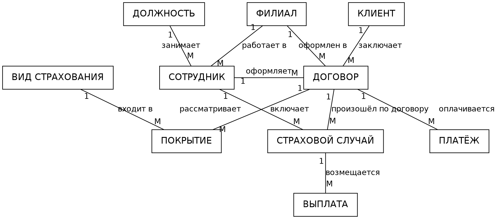
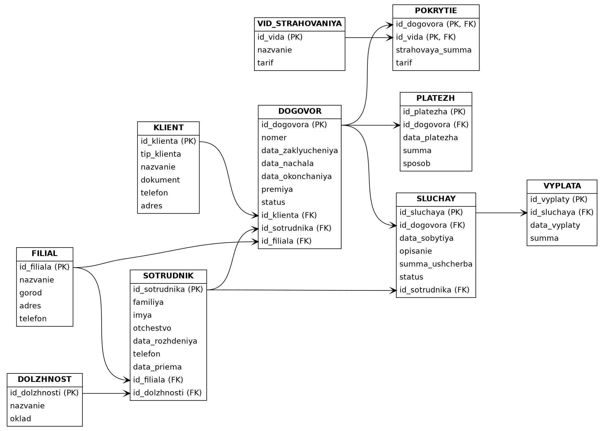

# Контрольная работа по дисциплине «Базы данных»

## Тема: проектирование базы данных «Страховая компания»

**Вопрос 1.** Спроектировать структуру базы данных «Страховая компания», содержащую сведения
о клиентах, сотрудниках и договорах компании.

**Задание 1.** Создать инфологическую модель, описывающую БД в терминах таких понятий,
как «сущность», «набор объектов», «связи сущностей и наборов объектов».

**Задание 2.** Трансформировать инфологическую модель в схему реляционной БД, использующей
понятие отношения. Полученная схема используется для заполнения БД информацией —
построения экземпляра БД.

## Содержание

1. Этап проектирования
2. Задание 1. Инфологическая модель
3. Задание 2. Схема реляционной базы данных
4. Нормализация схемы
5. Экземпляр базы данных
6. Примеры запросов к базе данных
7. Вывод

---

## 1. Этап проектирования

### 1.1. Описание предметной области

Страховая компания состоит из нескольких филиалов. В филиалах работают сотрудники,
каждый из которых занимает определённую должность. Сотрудники-агенты заключают
договоры страхования с клиентами, а сотрудники-эксперты рассматривают страховые случаи.

Клиентами компании могут быть как физические, так и юридические лица. С клиентом
заключается договор страхования, у которого есть номер, дата заключения, срок действия
и страховая премия (сумма, которую клиент платит компании).

Компания предлагает несколько видов страхования: ОСАГО, КАСКО, страхование жизни,
страхование недвижимости и другие. Один договор может включать сразу несколько видов
страхования, и для каждого вида в договоре указывается своя страховая сумма
(сумма, в пределах которой компания выплачивает возмещение). При этом один и тот же
вид страхования используется во многих договорах.

Страховую премию клиент может платить не сразу, а частями, поэтому по каждому договору
хранятся сведения о платежах. Если в период действия договора происходит страховой случай
(ДТП, залив квартиры, пожар и т. п.), он регистрируется в базе данных, рассматривается
сотрудником-экспертом, и по нему делается страховая выплата.

### 1.2. Что должна хранить база данных

На этапе проектирования определено, какие сведения нужно хранить:

- список филиалов компании и должностей;
- сведения о сотрудниках: ФИО, дата рождения, телефон, дата приёма на работу,
  филиал и должность;
- сведения о клиентах: тип клиента, ФИО или название организации, паспорт или ИНН,
  телефон, адрес;
- справочник видов страхования с базовыми тарифами;
- договоры: номер, даты, премия, статус, клиент, агент, филиал;
- состав договора — какие виды страхования в него входят и на какую страховую сумму;
- платежи по договорам;
- страховые случаи и выплаты по ним.

### 1.3. Ограничения предметной области

1. Номер договора не повторяется.
2. Дата окончания договора позже даты начала.
3. Договор заключается с одним клиентом и оформляется одним сотрудником-агентом.
4. В договоре должен быть хотя бы один вид страхования, и один вид не может
   входить в договор дважды.
5. Страховой случай относится только к одному договору, а его дата должна попадать
   в срок действия этого договора.
6. Выплата делается только по страховому случаю и не может быть больше страховой суммы.
7. Страховые суммы, премии и выплаты — положительные числа.

---

## 2. Задание 1. Инфологическая модель

Инфологическая модель описывает базу данных в виде сущностей и связей между ними
(модель «сущность — связь», ER-модель). Используются следующие понятия:

- **сущность** — отдельный объект предметной области, о котором хранятся сведения
  (например, договор № ДС-2025-000101);
- **набор объектов** — множество однотипных сущностей, которые описываются одними
  и теми же атрибутами (например, все ДОГОВОРЫ);
- **атрибут** — свойство сущности (номер договора, дата заключения);
- **ключ** — атрибут, по которому сущность однозначно определяется в наборе объектов;
- **связь** — отношение между наборами объектов; связь бывает «один к одному» (1:1),
  «один ко многим» (1:М) и «многие ко многим» (М:М).

### 2.1. Наборы объектов

| № | Набор объектов | Что описывает | Ключ |
|---|---|---|---|
| 1 | ФИЛИАЛ | подразделение компании | Код филиала |
| 2 | ДОЛЖНОСТЬ | должность в штате | Код должности |
| 3 | СОТРУДНИК | работник компании | Код сотрудника |
| 4 | КЛИЕНТ | страхователь | Код клиента |
| 5 | ВИД СТРАХОВАНИЯ | страховой продукт | Код вида |
| 6 | ДОГОВОР | договор страхования | Код договора |
| 7 | ПОКРЫТИЕ | вид страхования в составе договора | Код договора + код вида |
| 8 | ПЛАТЁЖ | платёж клиента по договору | Код платежа |
| 9 | СТРАХОВОЙ СЛУЧАЙ | событие по договору | Код случая |
| 10 | ВЫПЛАТА | возмещение по страховому случаю | Код выплаты |

### 2.2. Атрибуты наборов объектов

Ключевые атрибуты выделены полужирным.

**ФИЛИАЛ**: **Код филиала**, Название, Город, Адрес, Телефон.

**ДОЛЖНОСТЬ**: **Код должности**, Название, Оклад.

**СОТРУДНИК**: **Код сотрудника**, Фамилия, Имя, Отчество, Дата рождения, Телефон,
Дата приёма на работу, Код филиала, Код должности.

**КЛИЕНТ**: **Код клиента**, Тип клиента (физическое или юридическое лицо),
ФИО или название организации, Паспорт или ИНН, Телефон, Адрес.

**ВИД СТРАХОВАНИЯ**: **Код вида**, Название, Базовый тариф.

**ДОГОВОР**: **Код договора**, Номер договора, Дата заключения, Дата начала,
Дата окончания, Страховая премия, Статус, Код клиента, Код сотрудника (агента),
Код филиала.

**ПОКРЫТИЕ**: **Код договора + Код вида страхования**, Страховая сумма, Тариф.

**ПЛАТЁЖ**: **Код платежа**, Код договора, Дата платежа, Сумма, Способ оплаты.

**СТРАХОВОЙ СЛУЧАЙ**: **Код случая**, Код договора, Дата события, Описание,
Сумма ущерба, Статус, Код сотрудника (эксперта).

**ВЫПЛАТА**: **Код выплаты**, Код случая, Дата выплаты, Сумма выплаты.

### 2.3. Связи сущностей и наборов объектов

| № | Связь | Наборы объектов | Тип |
|---|---|---|---|
| 1 | работает в | ФИЛИАЛ — СОТРУДНИК | 1:М |
| 2 | занимает | ДОЛЖНОСТЬ — СОТРУДНИК | 1:М |
| 3 | заключает | КЛИЕНТ — ДОГОВОР | 1:М |
| 4 | оформляет | СОТРУДНИК — ДОГОВОР | 1:М |
| 5 | оформлен в | ФИЛИАЛ — ДОГОВОР | 1:М |
| 6 | включает | ДОГОВОР — ВИД СТРАХОВАНИЯ | М:М (через ПОКРЫТИЕ) |
| 7 | оплачивается | ДОГОВОР — ПЛАТЁЖ | 1:М |
| 8 | произошёл по договору | ДОГОВОР — СТРАХОВОЙ СЛУЧАЙ | 1:М |
| 9 | рассматривает | СОТРУДНИК — СТРАХОВОЙ СЛУЧАЙ | 1:М |
| 10 | возмещается | СТРАХОВОЙ СЛУЧАЙ — ВЫПЛАТА | 1:М |

Пояснения к связям:

- В одном филиале работает много сотрудников, но каждый сотрудник работает
  только в одном филиале — это связь 1:М. Так же устроены связи 2, 4, 5, 7, 8, 9, 10.
- Один клиент может заключить несколько договоров, но каждый договор заключается
  с одним клиентом (связь 3).
- Связь 6 — «многие ко многим»: договор может включать несколько видов страхования,
  а каждый вид страхования встречается во многих договорах. У этой связи есть свои
  атрибуты (страховая сумма и тариф по каждому виду), поэтому она показана
  отдельным набором объектов ПОКРЫТИЕ.

### 2.4. ER-диаграмма



Рисунок 1 — Инфологическая модель базы данных «Страховая компания»

---

## 3. Задание 2. Схема реляционной базы данных

### 3.1. Как инфологическая модель превращается в реляционную

В реляционной базе данных используется понятие **отношения** — таблицы, строки которой
называются кортежами, а столбцы — атрибутами. Переход от инфологической модели
к реляционной схеме выполняется по правилам:

1. Каждый набор объектов становится отдельной таблицей, сущность — строкой таблицы,
   атрибут — столбцом.
2. Ключ набора объектов становится первичным ключом таблицы (PK).
3. Связь 1:М реализуется так: первичный ключ таблицы со стороны «один» добавляется
   в таблицу со стороны «многие» как внешний ключ (FK).
4. Связь М:М напрямую в реляционной БД задать нельзя, поэтому для неё создаётся
   дополнительная (связующая) таблица. Её первичный ключ составной — из внешних ключей
   обеих таблиц. Так связь «ДОГОВОР — ВИД СТРАХОВАНИЯ» превратилась в таблицу
   POKRYTIE с первичным ключом (id_dogovora, id_vida).

В результате получилось 10 таблиц.

### 3.2. Описание таблиц

Обозначения: PK — первичный ключ, FK — внешний ключ.

**1. FILIAL — филиалы**

| Столбец | Тип | Ключ | Описание |
|---|---|---|---|
| id_filiala | INT | PK | код филиала |
| nazvanie | VARCHAR(100) | | название филиала |
| gorod | VARCHAR(50) | | город |
| adres | VARCHAR(150) | | адрес |
| telefon | VARCHAR(20) | | телефон |

**2. DOLZHNOST — должности**

| Столбец | Тип | Ключ | Описание |
|---|---|---|---|
| id_dolzhnosti | INT | PK | код должности |
| nazvanie | VARCHAR(50) | | название должности |
| oklad | DECIMAL(10,2) | | оклад |

**3. SOTRUDNIK — сотрудники**

| Столбец | Тип | Ключ | Описание |
|---|---|---|---|
| id_sotrudnika | INT | PK | код сотрудника |
| familiya | VARCHAR(50) | | фамилия |
| imya | VARCHAR(50) | | имя |
| otchestvo | VARCHAR(50) | | отчество |
| data_rozhdeniya | DATE | | дата рождения |
| telefon | VARCHAR(20) | | телефон |
| data_priema | DATE | | дата приёма на работу |
| id_filiala | INT | FK | филиал, в котором работает |
| id_dolzhnosti | INT | FK | должность |

**4. KLIENT — клиенты**

| Столбец | Тип | Ключ | Описание |
|---|---|---|---|
| id_klienta | INT | PK | код клиента |
| tip_klienta | VARCHAR(10) | | «физ. лицо» или «юр. лицо» |
| nazvanie | VARCHAR(150) | | ФИО или название организации |
| dokument | VARCHAR(20) | | паспорт (для физ. лица) или ИНН (для юр. лица) |
| telefon | VARCHAR(20) | | телефон |
| adres | VARCHAR(150) | | адрес |

**5. VID_STRAHOVANIYA — виды страхования**

| Столбец | Тип | Ключ | Описание |
|---|---|---|---|
| id_vida | INT | PK | код вида страхования |
| nazvanie | VARCHAR(80) | | название (ОСАГО, КАСКО и т. д.) |
| tarif | DECIMAL(5,4) | | базовый тариф |

**6. DOGOVOR — договоры**

| Столбец | Тип | Ключ | Описание |
|---|---|---|---|
| id_dogovora | INT | PK | код договора |
| nomer | VARCHAR(20) | | номер договора |
| data_zaklyucheniya | DATE | | дата заключения |
| data_nachala | DATE | | дата начала действия |
| data_okonchaniya | DATE | | дата окончания действия |
| premiya | DECIMAL(10,2) | | страховая премия |
| status | VARCHAR(15) | | «действует», «завершён», «расторгнут» |
| id_klienta | INT | FK | клиент |
| id_sotrudnika | INT | FK | агент, оформивший договор |
| id_filiala | INT | FK | филиал |

**7. POKRYTIE — состав договора (связующая таблица)**

| Столбец | Тип | Ключ | Описание |
|---|---|---|---|
| id_dogovora | INT | PK, FK | договор |
| id_vida | INT | PK, FK | вид страхования |
| strahovaya_summa | DECIMAL(12,2) | | страховая сумма по этому виду |
| tarif | DECIMAL(5,4) | | тариф, применённый в договоре |

**8. PLATEZH — платежи**

| Столбец | Тип | Ключ | Описание |
|---|---|---|---|
| id_platezha | INT | PK | код платежа |
| id_dogovora | INT | FK | договор |
| data_platezha | DATE | | дата платежа |
| summa | DECIMAL(10,2) | | сумма платежа |
| sposob | VARCHAR(20) | | способ оплаты |

**9. SLUCHAY — страховые случаи**

| Столбец | Тип | Ключ | Описание |
|---|---|---|---|
| id_sluchaya | INT | PK | код страхового случая |
| id_dogovora | INT | FK | договор |
| data_sobytiya | DATE | | дата события |
| opisanie | VARCHAR(200) | | что произошло |
| summa_ushcherba | DECIMAL(12,2) | | сумма ущерба |
| status | VARCHAR(20) | | «на рассмотрении», «признан», «отказано» |
| id_sotrudnika | INT | FK | эксперт, который рассматривает случай |

**10. VYPLATA — выплаты**

| Столбец | Тип | Ключ | Описание |
|---|---|---|---|
| id_vyplaty | INT | PK | код выплаты |
| id_sluchaya | INT | FK | страховой случай |
| data_vyplaty | DATE | | дата выплаты |
| summa | DECIMAL(12,2) | | сумма выплаты |

Кратко схему можно записать так (первым указан первичный ключ):

```
FILIAL           (id_filiala, nazvanie, gorod, adres, telefon)
DOLZHNOST        (id_dolzhnosti, nazvanie, oklad)
SOTRUDNIK        (id_sotrudnika, familiya, imya, otchestvo, data_rozhdeniya,
                  telefon, data_priema, id_filiala, id_dolzhnosti)
KLIENT           (id_klienta, tip_klienta, nazvanie, dokument, telefon, adres)
VID_STRAHOVANIYA (id_vida, nazvanie, tarif)
DOGOVOR          (id_dogovora, nomer, data_zaklyucheniya, data_nachala,
                  data_okonchaniya, premiya, status, id_klienta,
                  id_sotrudnika, id_filiala)
POKRYTIE         (id_dogovora, id_vida, strahovaya_summa, tarif)
PLATEZH          (id_platezha, id_dogovora, data_platezha, summa, sposob)
SLUCHAY          (id_sluchaya, id_dogovora, data_sobytiya, opisanie,
                  summa_ushcherba, status, id_sotrudnika)
VYPLATA          (id_vyplaty, id_sluchaya, data_vyplaty, summa)
```

### 3.3. Связи между таблицами по конкретным полям

| № | Таблица и поле (внешний ключ) | Связана с таблицей и полем (первичный ключ) | Тип связи |
|---|---|---|---|
| 1 | SOTRUDNIK.id_filiala | FILIAL.id_filiala | 1:М |
| 2 | SOTRUDNIK.id_dolzhnosti | DOLZHNOST.id_dolzhnosti | 1:М |
| 3 | DOGOVOR.id_klienta | KLIENT.id_klienta | 1:М |
| 4 | DOGOVOR.id_sotrudnika | SOTRUDNIK.id_sotrudnika | 1:М |
| 5 | DOGOVOR.id_filiala | FILIAL.id_filiala | 1:М |
| 6 | POKRYTIE.id_dogovora | DOGOVOR.id_dogovora | М:М (первая половина связи) |
| 7 | POKRYTIE.id_vida | VID_STRAHOVANIYA.id_vida | М:М (вторая половина связи) |
| 8 | PLATEZH.id_dogovora | DOGOVOR.id_dogovora | 1:М |
| 9 | SLUCHAY.id_dogovora | DOGOVOR.id_dogovora | 1:М |
| 10 | SLUCHAY.id_sotrudnika | SOTRUDNIK.id_sotrudnika | 1:М |
| 11 | VYPLATA.id_sluchaya | SLUCHAY.id_sluchaya | 1:М |

### 3.4. Схема базы данных



Рисунок 2 — Схема реляционной базы данных со связями между таблицами по полям

### 3.5. Создание таблиц на языке SQL

Ниже приведены запросы, которыми созданы основные таблицы схемы.

```sql
CREATE TABLE filial (
    id_filiala INT PRIMARY KEY,
    nazvanie   VARCHAR(100) NOT NULL,
    gorod      VARCHAR(50)  NOT NULL,
    adres      VARCHAR(150),
    telefon    VARCHAR(20)
);

CREATE TABLE dolzhnost (
    id_dolzhnosti INT PRIMARY KEY,
    nazvanie      VARCHAR(50) NOT NULL,
    oklad         DECIMAL(10,2)
);

CREATE TABLE sotrudnik (
    id_sotrudnika   INT PRIMARY KEY,
    familiya        VARCHAR(50) NOT NULL,
    imya            VARCHAR(50) NOT NULL,
    otchestvo       VARCHAR(50),
    data_rozhdeniya DATE,
    telefon         VARCHAR(20),
    data_priema     DATE,
    id_filiala      INT REFERENCES filial(id_filiala),
    id_dolzhnosti   INT REFERENCES dolzhnost(id_dolzhnosti)
);

CREATE TABLE klient (
    id_klienta  INT PRIMARY KEY,
    tip_klienta VARCHAR(10) NOT NULL,
    nazvanie    VARCHAR(150) NOT NULL,
    dokument    VARCHAR(20),
    telefon     VARCHAR(20),
    adres       VARCHAR(150)
);

CREATE TABLE vid_strahovaniya (
    id_vida  INT PRIMARY KEY,
    nazvanie VARCHAR(80) NOT NULL,
    tarif    DECIMAL(5,4) NOT NULL
);

CREATE TABLE dogovor (
    id_dogovora        INT PRIMARY KEY,
    nomer              VARCHAR(20) NOT NULL UNIQUE,
    data_zaklyucheniya DATE NOT NULL,
    data_nachala       DATE NOT NULL,
    data_okonchaniya   DATE NOT NULL,
    premiya            DECIMAL(10,2) NOT NULL,
    status             VARCHAR(15) NOT NULL,
    id_klienta         INT REFERENCES klient(id_klienta),
    id_sotrudnika      INT REFERENCES sotrudnik(id_sotrudnika),
    id_filiala         INT REFERENCES filial(id_filiala),
    CHECK (data_okonchaniya > data_nachala),
    CHECK (premiya > 0)
);

CREATE TABLE pokrytie (
    id_dogovora      INT REFERENCES dogovor(id_dogovora),
    id_vida          INT REFERENCES vid_strahovaniya(id_vida),
    strahovaya_summa DECIMAL(12,2) NOT NULL,
    tarif            DECIMAL(5,4) NOT NULL,
    PRIMARY KEY (id_dogovora, id_vida)
);

CREATE TABLE platezh (
    id_platezha   INT PRIMARY KEY,
    id_dogovora   INT REFERENCES dogovor(id_dogovora),
    data_platezha DATE NOT NULL,
    summa         DECIMAL(10,2) NOT NULL,
    sposob        VARCHAR(20)
);

CREATE TABLE sluchay (
    id_sluchaya      INT PRIMARY KEY,
    id_dogovora      INT REFERENCES dogovor(id_dogovora),
    data_sobytiya    DATE NOT NULL,
    opisanie         VARCHAR(200),
    summa_ushcherba  DECIMAL(12,2),
    status           VARCHAR(20) NOT NULL,
    id_sotrudnika    INT REFERENCES sotrudnik(id_sotrudnika)
);

CREATE TABLE vyplata (
    id_vyplaty  INT PRIMARY KEY,
    id_sluchaya INT REFERENCES sluchay(id_sluchaya),
    data_vyplaty DATE NOT NULL,
    summa       DECIMAL(12,2) NOT NULL
);
```

---

## 4. Нормализация схемы

**Первая нормальная форма (1НФ).** Все поля таблиц содержат только одно значение,
повторяющихся групп нет. Например, виды страхования по договору не записаны
в одно поле списком, а вынесены в отдельную таблицу POKRYTIE; платежи по договору —
в таблицу PLATEZH. ФИО сотрудника разделено на фамилию, имя и отчество.

**Вторая нормальная форма (2НФ).** Все неключевые поля зависят от полного первичного
ключа. Проверять это нужно там, где ключ составной, то есть в таблице POKRYTIE:
страховая сумма и тариф зависят сразу от договора и от вида страхования, а не
от одного из них. Название вида страхования в эту таблицу не добавлено, потому что
оно зависело бы только от id_vida — оно хранится в таблице VID_STRAHOVANIYA.

**Третья нормальная форма (3НФ).** Нет полей, которые зависят от других неключевых полей.
Например:

- в таблице SOTRUDNIK не хранятся название должности и оклад — иначе они зависели бы
  от id_dolzhnosti, а не от кода сотрудника; они находятся в таблице DOLZHNOST;
- в таблице SOTRUDNIK не хранится город филиала — он есть в таблице FILIAL;
- в таблице DOGOVOR не дублируются ФИО клиента и ФИО агента, хранятся только их коды;
- в таблице VYPLATA не хранится номер договора — его можно узнать через страховой случай.

Таким образом, все таблицы схемы находятся в третьей нормальной форме. Это избавляет
базу данных от дублирования сведений и от ошибок при добавлении, изменении
и удалении записей: например, чтобы переименовать должность, достаточно изменить
одну строку в таблице DOLZHNOST.

---

## 5. Экземпляр базы данных

По полученной схеме база данных заполнена информацией.

**FILIAL**

| id_filiala | nazvanie | gorod | adres | telefon |
|---|---|---|---|---|
| 1 | Головной офис | Москва | ул. Тверская, 12 | +7 495 100-10-10 |
| 2 | Северный | Санкт-Петербург | Невский пр., 84 | +7 812 200-20-20 |

**DOLZHNOST**

| id_dolzhnosti | nazvanie | oklad |
|---|---|---|
| 1 | Директор филиала | 180000.00 |
| 2 | Страховой агент | 60000.00 |
| 3 | Эксперт по убыткам | 90000.00 |

**SOTRUDNIK**

| id_sotrudnika | familiya | imya | otchestvo | data_priema | id_filiala | id_dolzhnosti |
|---|---|---|---|---|---|---|
| 1 | Фёдоров | Игорь | Александрович | 2005-03-01 | 1 | 1 |
| 2 | Смирнова | Анна | Сергеевна | 2018-06-11 | 1 | 2 |
| 3 | Кузнецов | Павел | Олегович | 2019-02-04 | 2 | 2 |
| 4 | Волкова | Мария | Ивановна | 2016-10-20 | 1 | 3 |

**KLIENT**

| id_klienta | tip_klienta | nazvanie | dokument | telefon |
|---|---|---|---|---|
| 1 | физ. лицо | Иванов Сергей Петрович | 4510 654321 | +7 916 111-22-33 |
| 2 | физ. лицо | Петрова Ольга Ивановна | 4012 123987 | +7 921 222-33-44 |
| 3 | юр. лицо | ООО «Логистик-Трейд» | 7701234567 | +7 495 333-44-55 |

**VID_STRAHOVANIYA**

| id_vida | nazvanie | tarif |
|---|---|---|
| 1 | ОСАГО | 0.0500 |
| 2 | КАСКО | 0.0700 |
| 3 | Страхование жизни и здоровья | 0.0150 |
| 4 | Страхование недвижимости | 0.0040 |
| 5 | Страхование грузов | 0.0090 |

**DOGOVOR**

| id_dogovora | nomer | data_zaklyucheniya | data_nachala | data_okonchaniya | premiya | status | id_klienta | id_sotrudnika | id_filiala |
|---|---|---|---|---|---|---|---|---|---|
| 1 | ДС-2025-000101 | 2025-01-15 | 2025-01-16 | 2026-01-15 | 62500.00 | действует | 1 | 2 | 1 |
| 2 | ДС-2025-000102 | 2025-03-02 | 2025-03-03 | 2026-03-02 | 18000.00 | действует | 2 | 3 | 2 |
| 3 | ДС-2025-000103 | 2025-05-20 | 2025-06-01 | 2026-05-31 | 135000.00 | действует | 3 | 2 | 1 |

**POKRYTIE**

| id_dogovora | id_vida | strahovaya_summa | tarif |
|---|---|---|---|
| 1 | 1 | 400000.00 | 0.0500 |
| 1 | 2 | 1200000.00 | 0.0350 |
| 1 | 3 | 300000.00 | 0.0150 |
| 2 | 4 | 4500000.00 | 0.0040 |
| 3 | 5 | 15000000.00 | 0.0090 |

Видно, что в первый договор входят три вида страхования, а один и тот же вид (например,
ОСАГО) может входить в разные договоры — так в реляционной базе данных реализована
связь «многие ко многим».

**PLATEZH**

| id_platezha | id_dogovora | data_platezha | summa | sposob |
|---|---|---|---|---|
| 1 | 1 | 2025-01-16 | 31250.00 | карта |
| 2 | 1 | 2025-07-14 | 31250.00 | карта |
| 3 | 2 | 2025-03-03 | 18000.00 | наличные |
| 4 | 3 | 2025-06-01 | 67500.00 | безналичный |

**SLUCHAY**

| id_sluchaya | id_dogovora | data_sobytiya | opisanie | summa_ushcherba | status | id_sotrudnika |
|---|---|---|---|---|---|---|
| 1 | 1 | 2025-04-08 | ДТП, повреждены бампер и капот | 145000.00 | признан | 4 |
| 2 | 2 | 2025-07-22 | Залив квартиры сверху | 260000.00 | на рассмотрении | 4 |

**VYPLATA**

| id_vyplaty | id_sluchaya | data_vyplaty | summa |
|---|---|---|---|
| 1 | 1 | 2025-04-25 | 130000.00 |

---

## 6. Примеры запросов к базе данных

Чтобы проверить, что схема работает, к полученному экземпляру базы данных выполнены
несколько запросов.

Договоры клиента и виды страхования, которые в них входят:

```sql
SELECT d.nomer, v.nazvanie, p.strahovaya_summa
FROM dogovor d
JOIN pokrytie p ON p.id_dogovora = d.id_dogovora
JOIN vid_strahovaniya v ON v.id_vida = p.id_vida
WHERE d.id_klienta = 1;
```

Сколько договоров заключил каждый агент и на какую сумму премий:

```sql
SELECT s.familiya, COUNT(*) AS kolichestvo, SUM(d.premiya) AS summa_premiy
FROM dogovor d
JOIN sotrudnik s ON s.id_sotrudnika = d.id_sotrudnika
GROUP BY s.familiya;
```

Страховые случаи по договору и выплаты по ним:

```sql
SELECT d.nomer, sl.data_sobytiya, sl.status, vp.summa
FROM sluchay sl
JOIN dogovor d ON d.id_dogovora = sl.id_dogovora
LEFT JOIN vyplata vp ON vp.id_sluchaya = sl.id_sluchaya;
```

Сотрудники филиала с указанием должности:

```sql
SELECT s.familiya, s.imya, dl.nazvanie, f.nazvanie
FROM sotrudnik s
JOIN dolzhnost dl ON dl.id_dolzhnosti = s.id_dolzhnosti
JOIN filial f ON f.id_filiala = s.id_filiala
WHERE f.id_filiala = 1;
```

Все запросы выполняются к спроектированным таблицам и не требуют изменения схемы,
значит структура базы данных подходит для решения задач страховой компании.

---

## 7. Вывод

В ходе контрольной работы спроектирована структура базы данных «Страховая компания».

На этапе проектирования описана предметная область и определено, какие сведения
о клиентах, сотрудниках и договорах должна хранить база данных.

В первом задании построена инфологическая модель: выделено 10 наборов объектов
с их атрибутами и ключами и 10 связей между ними, в том числе связь «многие ко многим»
между договорами и видами страхования.

Во втором задании инфологическая модель преобразована в схему реляционной базы данных
из 10 таблиц. Связи 1:М реализованы с помощью внешних ключей, а связь М:М — с помощью
связующей таблицы POKRYTIE с составным первичным ключом. Все связи между таблицами
указаны по конкретным полям. Схема приведена к третьей нормальной форме, заполнена
информацией (построен экземпляр базы данных) и проверена запросами.
