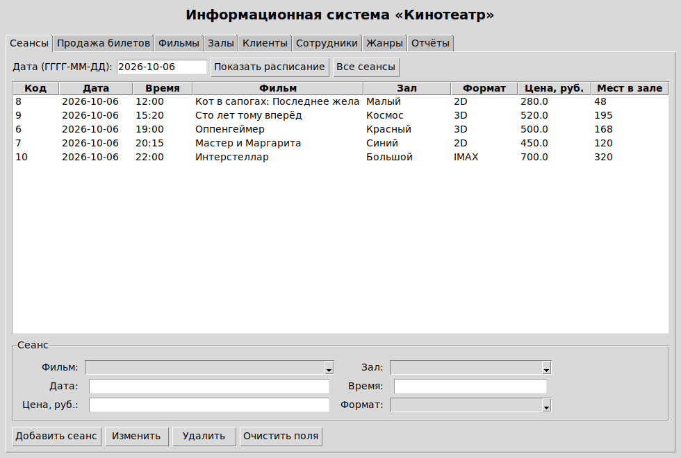
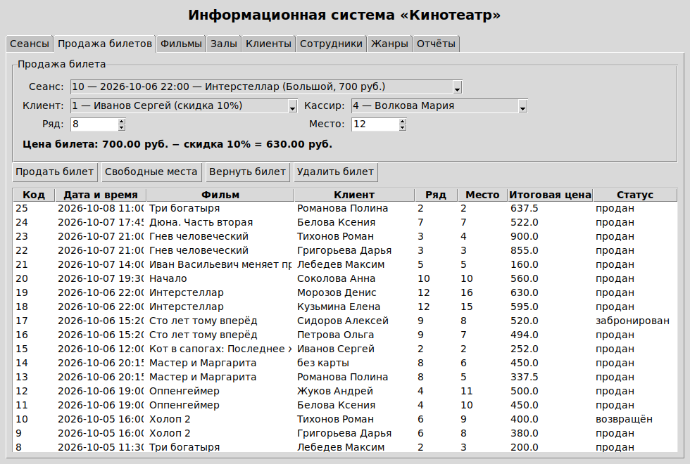
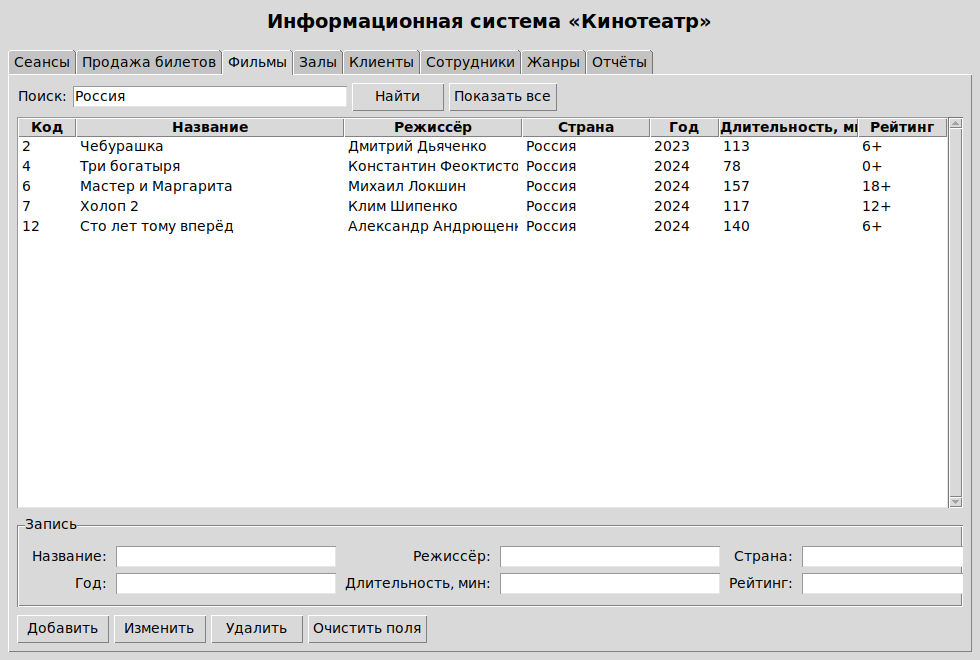
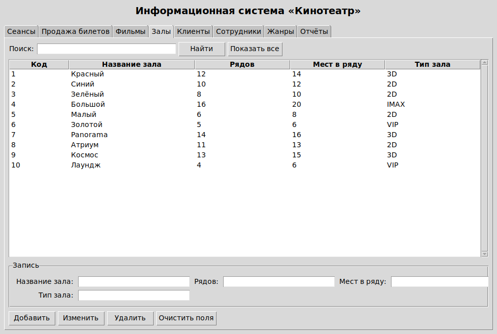
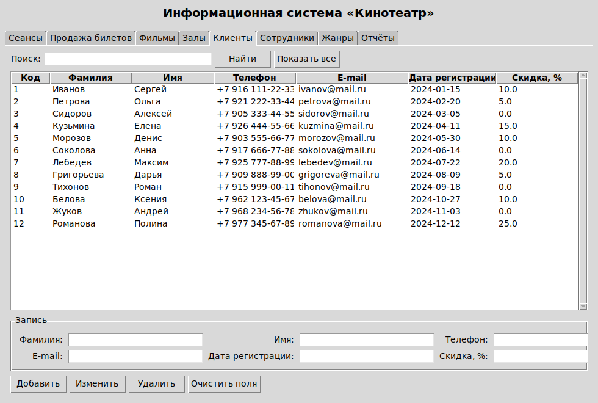
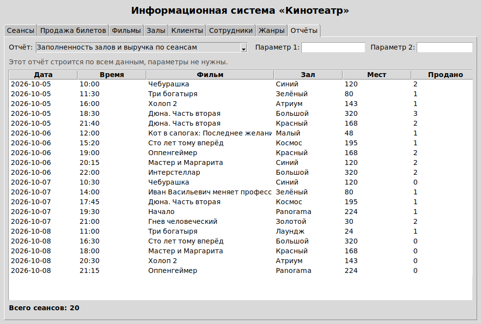
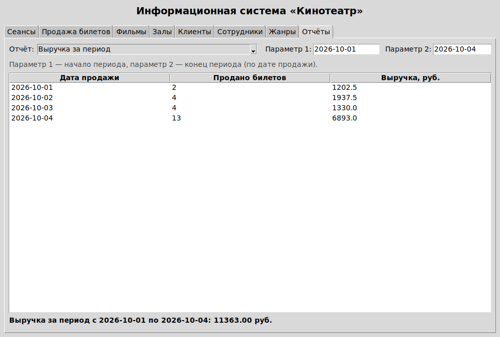
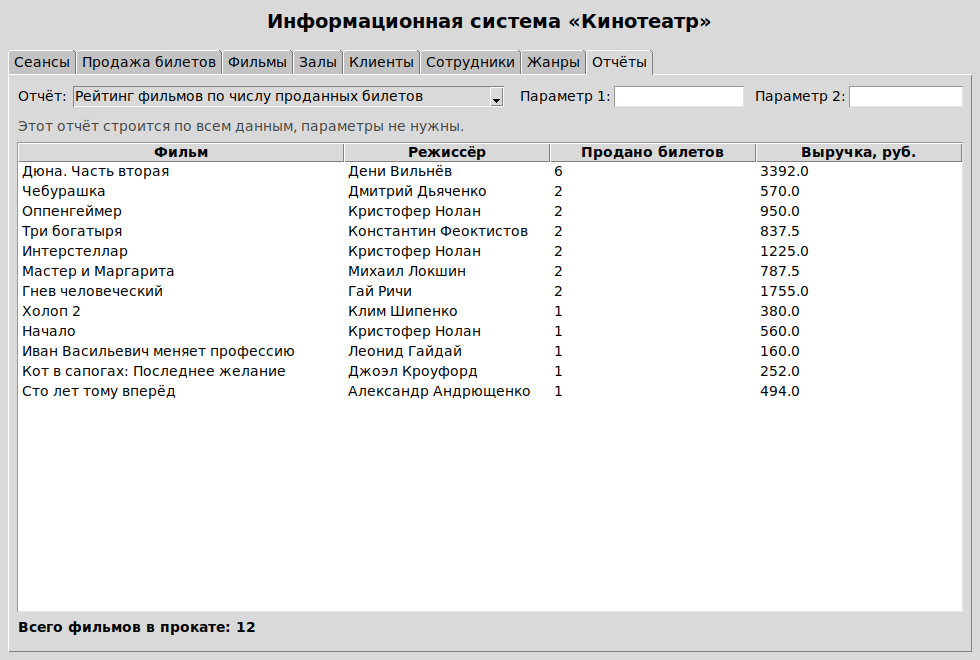

# Курсовой проект по дисциплине «Базы данных»

## Тема: Проектирование и разработка базы данных «Кинотеатр»

### Этап 2. Разработка и заполнение таблиц базы данных. Программная реализация и отладка приложения

## Введение

На первом этапе была проанализирована предметная область, построена инфологическая модель и спроектирована схема реляционной базы данных «Кинотеатр» из восьми таблиц, реализованная средствами СУБД SQLite.

Задачи второго этапа:

1. заполнить таблицы базы данных контрольными данными (не менее 10 записей в каждой таблице);
2. разработать программное приложение для работы с базой данных, реализующее добавление, изменение, удаление, поиск и отбор информации;
3. отладить приложение и провести тестирование его работы.

## 1. Заполнение таблиц базы данных

Данные внесены скриптом `kino_dannye.sql`, который выполняется после скрипта создания структуры. Данные подобраны так, чтобы выполнялись все ограничения целостности, заданные на первом этапе, и чтобы на их основе можно было проверить работу всех функций приложения.

### 1.1. Объём заполненных таблиц

| Таблица | Содержание | Записей |
|-------------------|----------------------------------------------------------------|-------------|
| ZHANR | жанры фильмов | 10 |
| FILM | фильмы в прокате | 12 |
| FILM_ZHANR | жанры фильмов (связующая таблица) | 24 |
| ZAL | залы кинотеатра | 10 |
| SEANS | сеансы расписания | 20 |
| KLIENT | зарегистрированные клиенты | 12 |
| SOTRUDNIK | сотрудники кинотеатра | 10 |
| BILET | проданные билеты | 25 |

Требование «не менее 10 записей в каждой таблице» выполнено для всех восьми таблиц.

### 1.2. Пример заполнения

Фрагмент таблицы ZAL. Последний столбец — вычисляемый, его значения база данных рассчитывает сама:

| id_zala | nazvanie | kolichestvo_ryadov | mest_v_ryadu | tip_zala | vsego_mest |
|----------|------------|--------------------------|------------------|------------|---------------|
| 1 | Красный | 12 | 14 | 3D | 168 |
| 2 | Синий | 10 | 12 | 2D | 120 |
| 4 | Большой | 16 | 20 | IMAX | 320 |
| 6 | Золотой | 5 | 6 | VIP | 30 |
| 10 | Лаундж | 4 | 6 | VIP | 24 |

Фрагмент таблицы BILET. Столбец «Итоговая цена» также вычисляемый: цена без скидки умножается на (1 − скидка/100):

| id_bileta | id_seansa | Клиент | Ряд | Место | Цена без скидки | Скидка, % | Итоговая цена |
|----------|----------|--------------------|---|------|-----------------|----------|---------------|
| 1 | 1 | Иванов Сергей | 7 | 10 | 650,00 | 10 | 585,00 |
| 3 | 1 | без карты | 7 | 12 | 650,00 | 0 | 650,00 |
| 13 | 7 | Романова Полина | 8 | 5 | 450,00 | 25 | 337,50 |
| 22 | 13 | Григорьева Дарья | 3 | 3 | 900,00 | 5 | 855,00 |

### 1.3. Пример записи, вносимой в таблицу

```sql
INSERT INTO zal (nazvanie, kolichestvo_ryadov, mest_v_ryadu, tip_zala)
VALUES ('Красный', 12, 14, '3D');

INSERT INTO seans (id_filma, id_zala, data_seansa, vremya_nachala,
                   bazovaya_cena, format_pokaza)
VALUES (1, 4, '2026-10-05', '18:30', 650, 'IMAX');
```

## 2. Разработка программного приложения

### 2.1. Выбор средств разработки

Приложение написано на языке **Python** с использованием библиотеки **tkinter** для построения оконного интерфейса и встроенного модуля **sqlite3** для работы с базой данных. Такой выбор сделан по следующим причинам:

- tkinter и sqlite3 входят в стандартную поставку Python, поэтому для запуска программы не нужно устанавливать дополнительные библиотеки;
- база данных хранится в одном файле `kinoteatr.db` рядом с программой, сервер базы данных не требуется;
- программа работает в операционной системе Windows и запускается одной командой.

Состав файлов приложения:

| Файл | Назначение |
|----------------------------|---------------------------------------------------------------------|
| `kinoteatr.py` | программа (867 строк с комментариями) |
| `kino_schema.sql` | скрипт создания таблиц, ключей, ограничений и представлений |
| `kino_dannye.sql` | скрипт заполнения таблиц контрольными данными |
| `kinoteatr.db` | файл базы данных |

Если файла базы данных рядом с программой нет, при первом запуске она создаётся автоматически из двух скриптов — это сделано для удобства проверки работы.

### 2.2. Структура приложения и основные методы

Программа построена по модульному принципу: работа с базой данных отделена от интерфейса. Ниже описаны классы и их основные методы.

**Класс BazaDannyh** — отвечает за подключение к базе данных и выполнение запросов:

| Метод | Назначение |
|-------------------------------------|------------------------------------------------------------|
| `__init__(fayl)` | подключается к файлу базы данных, включает контроль внешних ключей |
| `sozdat_bazu()` | создаёт таблицы и заполняет их данными, если файла базы нет |
| `vybrat(sql, parametry)` | выполняет запрос на выборку и возвращает список записей |
| `vypolnit(sql, parametry)` | выполняет запрос на изменение данных (INSERT, UPDATE, DELETE) |
| `zakryt()` | закрывает соединение с базой данных |

Все запросы выполняются с параметрами (вместо значений в тексте запроса подставляются знаки вопроса), что исключает ошибки при вводе кавычек и защищает от подстановки постороннего кода.

**Класс VkladkaSpravochnik** — универсальная вкладка для работы со справочниками (фильмы, залы, клиенты, сотрудники, жанры). Один класс используется для пяти таблиц: при создании ему передаются имя таблицы, список полей и их подписи на русском языке:

| Метод | Назначение |
|---------------------------|----------------------------------------------------------------------|
| `obnovit()` | заполняет таблицу на экране записями с учётом строки поиска |
| `vybrat_zapis()` | переносит выбранную строку таблицы в поля ввода |
| `dobavit()` | добавляет новую запись (INSERT) |
| `izmenit()` | сохраняет изменения выбранной записи (UPDATE) |
| `udalit()` | удаляет выбранную запись (DELETE) с подтверждением |
| `ochistit()` | очищает поля ввода |

**Класс VkladkaSeansy** — работа с расписанием. Фильм и зал выбираются из выпадающих списков, поэтому ввести несуществующий код нельзя. Методы `dobavit()`, `izmenit()`, `udalit()` обрабатывают ошибки целостности: при попытке назначить два сеанса в одном зале на одно время выводится понятное сообщение.

**Класс VkladkaBilety** — продажа и возврат билетов:

| Метод | Назначение |
|--------------------------------|-----------------------------------------------------------------|
| `zagruzit_spiski()` | загружает списки сеансов, клиентов и кассиров |
| `vybran_seans()` | ограничивает номера ряда и места размерами выбранного зала |
| `poschitat_cenu()` | рассчитывает цену билета с учётом скидки клиента |
| `prodat()` | продаёт билет, проверяя, не занято ли место |
| `pokazat_svobodnye()` | показывает количество свободных мест и список занятых |
| `vernut()` | оформляет возврат билета (меняет статус) |

**Класс VkladkaOtchety** — построение отчётов. Метод `podstavit_parametry()` автоматически подставляет в поля подходящие значения (например, границы периода продаж), метод `postroit()` выполняет запрос выбранного отчёта и выводит результат.

**Класс GlavnoeOkno** — главное окно программы. Создаёт подключение к базе данных и восемь вкладок, корректно закрывает соединение при выходе.

### 2.3. Реализованные функции

1. **Ведение справочников** — добавление, изменение и удаление фильмов, залов, клиентов, сотрудников и жанров.
2. **Поиск и отбор информации** — поиск по справочникам по нескольким полям сразу, отбор расписания по дате, отбор фильмов по жанру.
3. **Составление расписания** — добавление сеансов с контролем занятости залов.
4. **Продажа билетов** — автоматический расчёт цены с учётом скидки клиента, контроль занятости мест, просмотр свободных мест.
5. **Возврат билетов** — изменение статуса билета.
6. **Отчёты** — шесть отчётов о работе кинотеатра.

## 3. Результаты тестирования

Тестирование проводилось на заполненной базе данных. Проверялись как обычная работа, так и попытки ввести неверные данные.

| № | Что проверялось | Результат |
|---|-----------------------------------------------|----------------------------------------------|
| 1 | Продажа билета (сеанс «Чебурашка», ряд 9, место 9, клиент со скидкой) | Билет продан, записей стало 26, цена 300,00 руб. рассчитана верно |
| 2 | Повторная продажа того же места | Отклонено: «Место 9 в ряду 9 на этот сеанс уже продано» |
| 3 | Продажа билета в несуществующий ряд (99) | Отклонено: «В зале "Синий" 10 рядов по 12 мест» |
| 4 | Просмотр свободных мест | Показано: всего 120 мест, свободно 117 |
| 5 | Возврат билета | Статус билета изменён на «возвращён» |
| 6 | Поиск по справочнику фильмов по слову «Нолан» | Найдено 3 записи |
| 7 | Построение шести отчётов | Все отчёты построены, данные совпадают с содержимым таблиц |
| 8 | Добавление и удаление записи в справочнике жанров | Записей стало 11, после удаления снова 10 |
| 9 | Попытка удалить зал, на который назначены сеансы | Отклонено: «Запись удалить нельзя: на неё ссылаются записи других таблиц» |

Отдельно проверена работа вычисляемых столбцов: для зала «Большой» (16 рядов по 20 мест) значение `vsego_mest` равно 320; для билета ценой 650 руб. со скидкой 10 % значение `itogovaya_cena` равно 585 руб.

Ошибок в работе приложения не выявлено. Все ограничения целостности, заданные при проектировании базы данных, срабатывают, а программа выводит понятные пользователю сообщения вместо системных ошибок.

## 4. Экранные формы приложения

{width=15.5cm}

На вкладке «Сеансы» отображается расписание. В поле даты можно указать день и получить сеансы только за этот день. Фильм и зал при добавлении сеанса выбираются из выпадающих списков.

{width=15.5cm}

При выборе сеанса и клиента программа сама рассчитывает цену: базовая цена сеанса 700 руб., скидка клиента 10 %, к оплате 630 руб. Номера ряда и места ограничены размерами выбранного зала.

{width=15.5cm}

{width=15.5cm}

{width=15.5cm}

{width=15.5cm}

{width=15.5cm}

{width=15.5cm}

## 5. Краткая инструкция пользователя

1. **Запуск.** Поместить файлы `kinoteatr.py`, `kino_schema.sql`, `kino_dannye.sql` и `kinoteatr.db` в одну папку и запустить команду `python kinoteatr.py`.
2. **Расписание.** Вкладка «Сеансы»: ввести дату и нажать «Показать расписание»; кнопка «Все сеансы» снимает отбор. Чтобы добавить сеанс, выбрать фильм и зал, ввести дату, время, цену и формат, нажать «Добавить сеанс».
3. **Продажа билета.** Вкладка «Продажа билетов»: выбрать сеанс, клиента (или «без карты»), кассира, указать ряд и место, нажать «Продать билет». Кнопка «Свободные места» показывает, какие места уже заняты.
4. **Возврат билета.** Выбрать билет в таблице и нажать «Вернуть билет».
5. **Справочники.** Вкладки «Фильмы», «Залы», «Клиенты», «Сотрудники», «Жанры»: выбрать запись в таблице — её значения появятся в полях ввода; кнопки «Добавить», «Изменить», «Удалить» выполняют соответствующие действия. Строка поиска отбирает записи по нескольким полям.
6. **Отчёты.** Вкладка «Отчёты»: выбрать отчёт из списка — параметры подставятся автоматически, при необходимости изменить их и нажать «Построить отчёт».

## Выводы по второму этапу

Таблицы базы данных заполнены контрольными данными: во всех восьми таблицах не менее 10 записей, требования к объёму выполнены.

Разработано программное приложение на языке Python с оконным интерфейсом (библиотека tkinter) и файловой базой данных SQLite. Приложение состоит из пяти классов: работа с базой данных вынесена в отдельный класс, интерфейс разбит на вкладки. Реализованы добавление, изменение, удаление, поиск и отбор информации, продажа и возврат билетов с автоматическим расчётом цены, а также шесть отчётов о работе кинотеатра.

Проведено тестирование по девяти проверкам, включая попытки ввести некорректные данные. Все ограничения целостности срабатывают, ошибок в работе приложения не обнаружено.

Задачи второго этапа выполнены. На третьем этапе предстоит оформить пояснительную записку с описанием проделанной работы и приложением, содержащим исходный текст программы.
