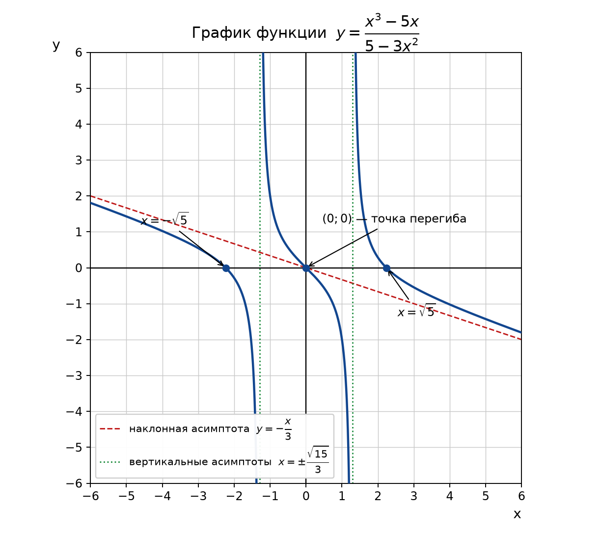

# Контрольная работа по дисциплине «Математика (математический анализ)»

## Задача 1. Вычислить пределы функций

**а)** Вычислить предел

$$\lim_{x\to\infty}\left(\dfrac{-3x^{3}+4x^{2}+1}{x^{3}+4x^{2}-2}\right)$$

**Решение.** При $x\to\infty$ числитель и знаменатель неограниченно возрастают, то есть имеем неопределённость вида $\dfrac{\infty}{\infty}$. Разделим числитель и знаменатель на старшую степень переменной, то есть на $x^{3}$:

$$\lim_{x\to\infty}\left(\frac{-3x^{3}+4x^{2}+1}{x^{3}+4x^{2}-2}\right)=\lim_{x\to\infty}\left(\frac{-3+\dfrac{4}{x}+\dfrac{1}{x^{3}}}{1+\dfrac{4}{x}-\dfrac{2}{x^{3}}}\right).$$

По свойству бесконечно малых величин $\dfrac{c}{x^{k}}\to 0$ при $x\to\infty$ для любого постоянного $c$ и $k>0$. Поэтому все дроби в числителе и знаменателе стремятся к нулю:

$$\lim_{x\to\infty}\left(\frac{-3+\dfrac{4}{x}+\dfrac{1}{x^{3}}}{1+\dfrac{4}{x}-\dfrac{2}{x^{3}}}\right)=\frac{-3+0+0}{1+0-0}=-3.$$

**Ответ:** $-3$.

**б)** Вычислить предел

$$\lim_{x\to 4}\left(\dfrac{x^{2}-16}{x^{2}-5x+4}\right)$$

**Решение.** Подстановка $x=4$ даёт неопределённость $\dfrac{0}{0}$, так как $4^{2}-16=0$ и $4^{2}-5\cdot4+4=0$. Разложим числитель и знаменатель на множители. Числитель — разность квадратов: $x^{2}-16=(x-4)(x+4)$. Корни знаменателя находим из уравнения $x^{2}-5x+4=0$: по теореме Виета $x_{1}=1$, $x_{2}=4$, следовательно $x^{2}-5x+4=(x-4)(x-1)$.

$$\lim_{x\to 4}\left(\frac{x^{2}-16}{x^{2}-5x+4}\right)=\lim_{x\to 4}\left(\frac{(x-4)(x+4)}{(x-4)(x-1)}\right).$$

При $x\to 4$, но $x\neq 4$, множитель $x-4\neq 0$, поэтому его можно сократить:

$$\lim_{x\to 4}\left(\frac{x+4}{x-1}\right)=\frac{4+4}{4-1}=\frac{8}{3}.$$

**Ответ:** $\dfrac{8}{3}$.

**в)** Вычислить предел

$$\lim_{x\to 0}\left(\dfrac{10x^{2}}{1-\cos x}\right)$$

**Решение.** Снова неопределённость $\dfrac{0}{0}$. Воспользуемся формулой понижения степени $1-\cos x=2\sin^{2}\dfrac{x}{2}$:

$$\lim_{x\to 0}\left(\frac{10x^{2}}{1-\cos x}\right)=\lim_{x\to 0}\left(\frac{10x^{2}}{2\sin^{2}\dfrac{x}{2}}\right).$$

Применим первый замечательный предел $\lim\limits_{u\to 0}\left(\dfrac{\sin u}{u}\right)=1$, из которого следует эквивалентность $\sin\dfrac{x}{2}\sim\dfrac{x}{2}$ при $x\to 0$. Тогда $\sin^{2}\dfrac{x}{2}\sim\dfrac{x^{2}}{4}$ и

$$\lim_{x\to 0}\left(\frac{10x^{2}}{2\cdot\dfrac{x^{2}}{4}}\right)=\lim_{x\to 0}\left(\frac{10x^{2}\cdot 4}{2x^{2}}\right)=20.$$

**Ответ:** $20$.

**г)** Вычислить предел

$$\lim_{x\to\infty}\left(\dfrac{2x-1}{2x+1}\right)^{x+1}$$

**Решение.** Основание степени стремится к единице, показатель — к бесконечности, значит имеем неопределённость вида $1^{\infty}$. Такие пределы раскрываются с помощью второго замечательного предела $\lim\limits_{u\to\infty}\left(1+\dfrac{1}{u}\right)^{u}=e$.

Выделим в основании единицу:

$$\frac{2x-1}{2x+1}=\frac{2x+1-2}{2x+1}=1-\frac{2}{2x+1}=1+\frac{1}{-\dfrac{2x+1}{2}}.$$

Обозначим $u=-\dfrac{2x+1}{2}$; при $x\to\infty$ имеем $u\to\infty$. Тогда

$$\left(\frac{2x-1}{2x+1}\right)^{x+1}=\left[\left(1+\frac{1}{u}\right)^{u}\right]^{\frac{x+1}{u}},\qquad \frac{x+1}{u}=\frac{x+1}{-\dfrac{2x+1}{2}}=-\frac{2(x+1)}{2x+1}.$$

Найдём предел показателя:

$$\lim_{x\to\infty}\left(-\frac{2x+2}{2x+1}\right)=-\lim_{x\to\infty}\left(\frac{2+\dfrac{2}{x}}{2+\dfrac{1}{x}}\right)=-1.$$

Выражение в квадратных скобках стремится к $e$, поэтому

$$\lim_{x\to\infty}\left(\frac{2x-1}{2x+1}\right)^{x+1}=e^{-1}=\frac{1}{e}\approx 0{,}368.$$

**Ответ:** $e^{-1}$.

## Задача 2. Найти производные следующих функций

При решении используются основные правила дифференцирования:
$(u\pm v)'=u'\pm v'$, $(uv)'=u'v+uv'$, $\left(\dfrac{u}{v}\right)'=\dfrac{u'v-uv'}{v^{2}}$, правило дифференцирования сложной функции $\bigl(f(g(x))\bigr)'=f'(g(x))\cdot g'(x)$, а также таблица производных.

**а)** Найти производную функции $y=\dfrac{1}{(x+2)\sqrt{x^{2}+4x+5}}$

**Решение.** Запишем функцию в виде произведения степеней, это удобнее, чем дифференцировать дробь:

$$y=(x+2)^{-1}\left(x^{2}+4x+5\right)^{-\frac12}.$$

Применим правило произведения и правило сложной функции $\left(u^{n}\right)'=n\,u^{\,n-1}u'$:

$$y'=-(x+2)^{-2}\left(x^{2}+4x+5\right)^{-\frac12}+(x+2)^{-1}\cdot\left(-\frac12\right)\left(x^{2}+4x+5\right)^{-\frac32}(2x+4).$$

Во втором слагаемом $-\dfrac12(2x+4)=-(x+2)$, и множитель $(x+2)^{-1}(x+2)=1$:

$$y'=-\frac{1}{(x+2)^{2}\sqrt{x^{2}+4x+5}}-\frac{1}{\left(x^{2}+4x+5\right)^{\frac32}}.$$

Приведём к общему знаменателю $(x+2)^{2}\left(x^{2}+4x+5\right)^{\frac32}$:

$$y'=-\frac{\left(x^{2}+4x+5\right)+(x+2)^{2}}{(x+2)^{2}\left(x^{2}+4x+5\right)^{\frac32}}=-\frac{x^{2}+4x+5+x^{2}+4x+4}{(x+2)^{2}\left(x^{2}+4x+5\right)^{\frac32}}.$$

**Ответ:** $y'=-\dfrac{2x^{2}+8x+9}{(x+2)^{2}\left(x^{2}+4x+5\right)^{\frac32}}$.

**б)** Найти производную функции $y=\ln\operatorname{tg}\left(\dfrac{\pi}{4}+\dfrac{x}{2}\right)$

**Решение.** Это сложная функция: внешняя — логарифм, затем тангенс, затем линейная функция. Дифференцируем по цепочке, используя $(\ln u)'=\dfrac{u'}{u}$ и $(\operatorname{tg}u)'=\dfrac{1}{\cos^{2}u}$. Обозначим $u=\dfrac{\pi}{4}+\dfrac{x}{2}$, тогда $u'=\dfrac12$:

$$y'=\frac{1}{\operatorname{tg}u}\cdot\frac{1}{\cos^{2}u}\cdot\frac12=\frac{\cos u}{\sin u}\cdot\frac{1}{\cos^{2}u}\cdot\frac12=\frac{1}{2\sin u\cos u}.$$

По формуле синуса двойного угла $2\sin u\cos u=\sin 2u$, а $2u=\dfrac{\pi}{2}+x$, поэтому $\sin 2u=\sin\left(\dfrac{\pi}{2}+x\right)=\cos x$. Окончательно:

$$y'=\frac{1}{\cos x}.$$

**Ответ:** $y'=\dfrac{1}{\cos x}$.

**в)** Найти производную функции $y=\arccos^{2}\sqrt{1-x}$

**Решение.** Здесь тройная сложная функция: $y=\left(\arccos v\right)^{2}$, где $v=\sqrt{1-x}$. Используем $\left(u^{2}\right)'=2uu'$, $(\arccos v)'=-\dfrac{v'}{\sqrt{1-v^{2}}}$ и $\left(\sqrt{w}\right)'=\dfrac{w'}{2\sqrt{w}}$.

Сначала найдём производную внутренней части:

$$v=\sqrt{1-x},\qquad v'=\frac{-1}{2\sqrt{1-x}},\qquad 1-v^{2}=1-(1-x)=x.$$

Тогда

$$\left(\arccos\sqrt{1-x}\right)'=-\frac{v'}{\sqrt{1-v^{2}}}=-\frac{1}{\sqrt{x}}\cdot\left(\frac{-1}{2\sqrt{1-x}}\right)=\frac{1}{2\sqrt{x}\sqrt{1-x}}.$$

Окончательно

$$y'=2\arccos\sqrt{1-x}\cdot\frac{1}{2\sqrt{x}\sqrt{1-x}}=\frac{\arccos\sqrt{1-x}}{\sqrt{x-x^{2}}}.$$

Область, где производная существует: $0<x<1$.

**Ответ:** $y'=\dfrac{\arccos\sqrt{1-x}}{\sqrt{x-x^{2}}}$.

**г)** Найти производную функции, заданной неявно:

$$\sin(xy)-2^{\,x-y}=0.$$

**Решение.** Функция задана **неявно**. Продифференцируем обе части равенства по $x$, считая $y=y(x)$ функцией от $x$ (то есть при дифференцировании $y$ даёт множитель $y'$). Используем $\left(a^{u}\right)'=a^{u}\ln a\cdot u'$:

$$\cos(xy)\cdot\left(y+xy'\right)-2^{\,x-y}\ln 2\cdot\left(1-y'\right)=0.$$

Раскроем скобки:

$$y\cos(xy)+xy'\cos(xy)-2^{\,x-y}\ln 2+2^{\,x-y}\ln 2\cdot y'=0.$$

Сгруппируем слагаемые с $y'$:

$$y'\left[x\cos(xy)+2^{\,x-y}\ln 2\right]=2^{\,x-y}\ln 2-y\cos(xy).$$

$$y'=\frac{2^{\,x-y}\ln 2-y\cos(xy)}{x\cos(xy)+2^{\,x-y}\ln 2}.$$

Из исходного уравнения $2^{\,x-y}=\sin(xy)$, поэтому ответ можно записать компактнее:

$$y'=\frac{\sin(xy)\ln 2-y\cos(xy)}{x\cos(xy)+\sin(xy)\ln 2}.$$

**Ответ:** $y'=\dfrac{2^{\,x-y}\ln 2-y\cos(xy)}{x\cos(xy)+2^{\,x-y}\ln 2}$.

**д)** Найти производную функции, заданной параметрически:

$$x=e^{\cos t},\qquad y=\operatorname{arctg}\sqrt[3]{t}.$$

**Решение.** Функция задана **параметрически**. Производная находится по формуле

$$\frac{dy}{dx}=\frac{y'_{t}}{x'_{t}},\qquad x'_{t}\neq 0.$$

Найдём производные по параметру. Для $x$ применяем правило сложной функции, $\left(e^{u}\right)'=e^{u}u'$:

$$x'_{t}=e^{\cos t}\cdot(-\sin t)=-e^{\cos t}\sin t.$$

Для $y$ используем $(\operatorname{arctg}u)'=\dfrac{u'}{1+u^{2}}$, где $u=t^{\frac13}$, $u'=\dfrac13 t^{-\frac23}$:

$$y'_{t}=\frac{1}{1+t^{\frac23}}\cdot\frac{1}{3\sqrt[3]{t^{2}}}=\frac{1}{3\sqrt[3]{t^{2}}\left(1+\sqrt[3]{t^{2}}\right)}.$$

Следовательно,

$$\frac{dy}{dx}=\frac{\dfrac{1}{3\sqrt[3]{t^{2}}\left(1+\sqrt[3]{t^{2}}\right)}}{-e^{\cos t}\sin t}=-\frac{1}{3\,e^{\cos t}\sin t\,\sqrt[3]{t^{2}}\left(1+\sqrt[3]{t^{2}}\right)}.$$

**Ответ:** $\dfrac{dy}{dx}=-\dfrac{1}{3\,e^{\cos t}\sin t\,\sqrt[3]{t^{2}}\left(1+\sqrt[3]{t^{2}}\right)}$, где $\sin t\neq 0$, $t\neq 0$.

## Задача 3. Полное исследование функции и построение графика

$$y=\frac{x^{3}-5x}{5-3x^{2}}.$$

**1. Область определения.** Знаменатель не должен обращаться в нуль:

$$5-3x^{2}\neq 0\ \Rightarrow\ x^{2}\neq\frac53\ \Rightarrow\ x\neq\pm\sqrt{\frac53}=\pm\frac{\sqrt{15}}{3}\approx\pm 1{,}29.$$

$$D(y)=\left(-\infty;-\tfrac{\sqrt{15}}{3}\right)\cup\left(-\tfrac{\sqrt{15}}{3};\tfrac{\sqrt{15}}{3}\right)\cup\left(\tfrac{\sqrt{15}}{3};+\infty\right).$$

**2. Чётность.** Проверим $y(-x)$:

$$y(-x)=\frac{(-x)^{3}-5(-x)}{5-3(-x)^{2}}=\frac{-x^{3}+5x}{5-3x^{2}}=-\frac{x^{3}-5x}{5-3x^{2}}=-y(x).$$

Функция **нечётная**, её график симметричен относительно начала координат. Это позволяет исследовать функцию при $x\geq 0$, а остальную часть графика достроить симметрично.

**3. Точки пересечения с осями и знаки функции.** Полагаем $y=0$:

$$x^{3}-5x=0\ \Rightarrow\ x\left(x^{2}-5\right)=0\ \Rightarrow\ x_{1}=0,\quad x_{2,3}=\pm\sqrt{5}\approx\pm 2{,}24.$$

График проходит через точки $(0;0)$, $\left(\sqrt5;0\right)$, $\left(-\sqrt5;0\right)$. При $x=0$ имеем $y=0$ — это же точка пересечения с осью $Oy$.

**4. Асимптоты.**

*Вертикальные.* В точках $x=\pm\dfrac{\sqrt{15}}{3}$ знаменатель обращается в нуль, а числитель — нет $\left(\text{при }x=\tfrac{\sqrt{15}}{3}\text{ числитель }\approx-4{,}30\right)$, значит это вертикальные асимптоты. Односторонние пределы:

$$\lim_{x\to\frac{\sqrt{15}}{3}-0}y=-\infty,\qquad \lim_{x\to\frac{\sqrt{15}}{3}+0}y=+\infty,$$

$$\lim_{x\to-\frac{\sqrt{15}}{3}-0}y=-\infty,\qquad \lim_{x\to-\frac{\sqrt{15}}{3}+0}y=+\infty.$$

*Горизонтальных асимптот нет*, так как $\lim\limits_{x\to\infty}y=\infty$ (степень числителя больше степени знаменателя).

*Наклонная асимптота* $y=kx+b$:

$$k=\lim_{x\to\infty}\left(\frac{y}{x}\right)=\lim_{x\to\infty}\left(\frac{x^{3}-5x}{x\left(5-3x^{2}\right)}\right)=\lim_{x\to\infty}\left(\frac{1-\dfrac{5}{x^{2}}}{\dfrac{5}{x^{2}}-3}\right)=-\frac13,$$

$$b=\lim_{x\to\infty}\left(y+\frac{x}{3}\right)=\lim_{x\to\infty}\left(\frac{3\left(x^{3}-5x\right)+x\left(5-3x^{2}\right)}{3\left(5-3x^{2}\right)}\right)=\lim_{x\to\infty}\left(\frac{-10x}{15-9x^{2}}\right)=0.$$

Итак, наклонная асимптота $y=-\dfrac{x}{3}$ (одна и та же при $x\to+\infty$ и при $x\to-\infty$).

**5. Монотонность и экстремумы.** Найдём первую производную по правилу дифференцирования дроби:

$$y'=\frac{\left(3x^{2}-5\right)\left(5-3x^{2}\right)-\left(x^{3}-5x\right)(-6x)}{\left(5-3x^{2}\right)^{2}}.$$

Раскроем числитель:

$$\left(3x^{2}-5\right)\left(5-3x^{2}\right)=-9x^{4}+30x^{2}-25,\qquad -\left(x^{3}-5x\right)(-6x)=6x^{4}-30x^{2},$$

$$-9x^{4}+30x^{2}-25+6x^{4}-30x^{2}=-3x^{4}-25.$$

$$y'=-\frac{3x^{4}+25}{\left(5-3x^{2}\right)^{2}}.$$

Числитель $3x^{4}+25>0$ и знаменатель $\left(5-3x^{2}\right)^{2}>0$ при всех допустимых $x$, поэтому $y'<0$ на всей области определения. Значит, функция **убывает** на каждом из трёх интервалов области определения, а **экстремумов нет** (производная нигде не обращается в нуль).

**6. Выпуклость и точки перегиба.** Найдём вторую производную:

$$y''=\left(-\frac{3x^{4}+25}{\left(5-3x^{2}\right)^{2}}\right)'=-\frac{12x^{3}\left(5-3x^{2}\right)^{2}-\left(3x^{4}+25\right)\cdot 2\left(5-3x^{2}\right)(-6x)}{\left(5-3x^{2}\right)^{4}}.$$

Вынесем $\left(5-3x^{2}\right)$ и сократим:

$$y''=-\frac{12x^{3}\left(5-3x^{2}\right)+12x\left(3x^{4}+25\right)}{\left(5-3x^{2}\right)^{3}}=-\frac{12x\left(5x^{2}-3x^{4}+3x^{4}+25\right)}{\left(5-3x^{2}\right)^{3}}=-\frac{60x\left(x^{2}+5\right)}{\left(5-3x^{2}\right)^{3}}.$$

Вторая производная обращается в нуль только при $x=0$ (так как $x^{2}+5>0$). Определим знаки $y''$ на интервалах, учитывая, что $5-3x^{2}>0$ при $|x|<\dfrac{\sqrt{15}}{3}$ и $5-3x^{2}<0$ при $|x|>\dfrac{\sqrt{15}}{3}$:

| Интервал | Знак $-60x\left(x^{2}+5\right)$ | Знак $\left(5-3x^{2}\right)^{3}$ | Знак $y''$ | Вид графика |
|---|---|---|---|---|
| от $-\infty$ до $-\sqrt{15}/3$ | плюс | минус | минус | выпукла вверх |
| от $-\sqrt{15}/3$ до $0$ | плюс | плюс | плюс | выпукла вниз |
| от $0$ до $\sqrt{15}/3$ | минус | плюс | минус | выпукла вверх |
| от $\sqrt{15}/3$ до $+\infty$ | минус | минус | плюс | выпукла вниз |

При переходе через точку $x=0$ вторая производная меняет знак, значит $(0;0)$ — **точка перегиба**.

**7. Сводная таблица поведения функции.**

| Участок области определения | $y'$ | $y''$ | Поведение функции |
|---|---|---|---|
| от $-\infty$ до $-\sqrt{15}/3$ | минус | минус | убывает, выпукла вверх |
| $x=-\sqrt{15}/3$ | не существует | не существует | вертикальная асимптота |
| от $-\sqrt{15}/3$ до $0$ | минус | плюс | убывает, выпукла вниз |
| $x=0$ | минус | равна нулю | точка перегиба $(0;0)$ |
| от $0$ до $\sqrt{15}/3$ | минус | минус | убывает, выпукла вверх |
| $x=\sqrt{15}/3$ | не существует | не существует | вертикальная асимптота |
| от $\sqrt{15}/3$ до $+\infty$ | минус | плюс | убывает, выпукла вниз |

**8. График.** По результатам исследования строим график: две вертикальные асимптоты $x=\pm\dfrac{\sqrt{15}}{3}$, наклонная асимптота $y=-\dfrac{x}{3}$, нули в точках $x=0$ и $x=\pm\sqrt5$, монотонное убывание на каждом интервале, перегиб в начале координат.

## Задача 4. Найти неопределённые интегралы

**а)** Вычислить интеграл

$$\int\frac{x}{\sqrt{4-x^{2}}}\,dx.$$

**Решение.** Применим метод замены переменной. Заметим, что $d\left(4-x^{2}\right)=-2x\,dx$, то есть $x\,dx=-\dfrac12 d\left(4-x^{2}\right)$. Положим $u=4-x^{2}$:

$$\int\frac{x\,dx}{\sqrt{4-x^{2}}}=-\frac12\int\frac{du}{\sqrt{u}}=-\frac12\int u^{-\frac12}\,du=-\frac12\cdot\frac{u^{\frac12}}{\frac12}+C=-\sqrt{u}+C.$$

Возвращаемся к переменной $x$:

$$\int\frac{x}{\sqrt{4-x^{2}}}\,dx=-\sqrt{4-x^{2}}+C,\qquad |x|<2.$$

*Проверка:* $\left(-\sqrt{4-x^{2}}\right)'=-\dfrac{-2x}{2\sqrt{4-x^{2}}}=\dfrac{x}{\sqrt{4-x^{2}}}$ — совпадает с подынтегральной функцией.

**Ответ:** $-\sqrt{4-x^{2}}+C$.

**б)** Вычислить интеграл

$$\int e^{3x}\sin x\,dx.$$

**Решение.** Интеграл берётся двукратным интегрированием по частям по формуле $\int u\,dv=uv-\int v\,du$. Обозначим искомый интеграл через $I$.

Первый раз: $u=e^{3x}$, $dv=\sin x\,dx$, тогда $du=3e^{3x}dx$, $v=-\cos x$:

$$I=-e^{3x}\cos x+3\int e^{3x}\cos x\,dx.$$

Второй раз для интеграла $\int e^{3x}\cos x\,dx$: $u=e^{3x}$, $dv=\cos x\,dx$, $du=3e^{3x}dx$, $v=\sin x$:

$$\int e^{3x}\cos x\,dx=e^{3x}\sin x-3\int e^{3x}\sin x\,dx=e^{3x}\sin x-3I.$$

Подставим это в первое равенство:

$$I=-e^{3x}\cos x+3\left(e^{3x}\sin x-3I\right)=-e^{3x}\cos x+3e^{3x}\sin x-9I.$$

Получилось линейное уравнение относительно $I$ («возвратный» интеграл):

$$10I=e^{3x}\left(3\sin x-\cos x\right)\ \Rightarrow\ I=\frac{e^{3x}\left(3\sin x-\cos x\right)}{10}+C.$$

**Ответ:** $\dfrac{e^{3x}\left(3\sin x-\cos x\right)}{10}+C$.

**в)** Вычислить интеграл

$$\int\frac{x^{4}+4x^{2}+15}{x^{3}+2x^{2}+5x}\,dx.$$

**Решение.** Дробь **неправильная** (степень числителя 4 больше степени знаменателя 3), поэтому сначала выделим целую часть делением многочленов:

$$\frac{x^{4}+4x^{2}+15}{x^{3}+2x^{2}+5x}=x-2+\frac{3x^{2}+10x+15}{x^{3}+2x^{2}+5x}.$$

Действительно, $x\left(x^{3}+2x^{2}+5x\right)=x^{4}+2x^{3}+5x^{2}$, остаток $-2x^{3}-x^{2}+15$; далее $-2\left(x^{3}+2x^{2}+5x\right)=-2x^{3}-4x^{2}-10x$, остаток $3x^{2}+10x+15$.

Разложим знаменатель на множители: $x^{3}+2x^{2}+5x=x\left(x^{2}+2x+5\right)$. Квадратный трёхчлен $x^{2}+2x+5$ действительных корней не имеет, так как $D=4-20=-16<0$.

Правильную дробь разложим на простейшие:

$$\frac{3x^{2}+10x+15}{x\left(x^{2}+2x+5\right)}=\frac{A}{x}+\frac{Bx+C}{x^{2}+2x+5}.$$

Приводим к общему знаменателю и приравниваем числители:

$$A\left(x^{2}+2x+5\right)+(Bx+C)x=3x^{2}+10x+15.$$

Сравниваем коэффициенты при одинаковых степенях:

$$\begin{aligned} x^{2}&:\ A+B=3,\\ x^{1}&:\ 2A+C=10,\\ x^{0}&:\ 5A=15. \end{aligned}$$

Из третьего уравнения $A=3$, тогда $B=0$, $C=10-6=4$. Значит

$$\frac{x^{4}+4x^{2}+15}{x^{3}+2x^{2}+5x}=x-2+\frac{3}{x}+\frac{4}{x^{2}+2x+5}.$$

Интегрируем почленно. В последнем слагаемом выделим полный квадрат: $x^{2}+2x+5=(x+1)^{2}+4$, и применим формулу $\displaystyle\int\frac{dt}{t^{2}+a^{2}}=\frac1a\operatorname{arctg}\frac{t}{a}+C$:

$$\int\frac{4\,dx}{(x+1)^{2}+2^{2}}=4\cdot\frac12\operatorname{arctg}\frac{x+1}{2}=2\operatorname{arctg}\frac{x+1}{2}.$$

Окончательно:

$$\int\frac{x^{4}+4x^{2}+15}{x^{3}+2x^{2}+5x}\,dx=\frac{x^{2}}{2}-2x+3\ln|x|+2\operatorname{arctg}\frac{x+1}{2}+C.$$

**Ответ:** $\dfrac{x^{2}}{2}-2x+3\ln|x|+2\operatorname{arctg}\dfrac{x+1}{2}+C$.

## Задача 5. Найти длину дуги кривой $y=\ln\left(1-x^{2}\right)$ от $x=0$ до $x=0{,}5$

**Решение.** Длина дуги кривой, заданной уравнением $y=f(x)$ на отрезке $[a;b]$, вычисляется по формуле

$$L=\int\limits_{a}^{b}\sqrt{1+\left(y'\right)^{2}}\,dx.$$

Найдём производную:

$$y'=\frac{\left(1-x^{2}\right)'}{1-x^{2}}=\frac{-2x}{1-x^{2}}.$$

Вычислим подкоренное выражение:

$$1+\left(y'\right)^{2}=1+\frac{4x^{2}}{\left(1-x^{2}\right)^{2}}=\frac{\left(1-x^{2}\right)^{2}+4x^{2}}{\left(1-x^{2}\right)^{2}}=\frac{1-2x^{2}+x^{4}+4x^{2}}{\left(1-x^{2}\right)^{2}}=\frac{x^{4}+2x^{2}+1}{\left(1-x^{2}\right)^{2}}.$$

В числителе — полный квадрат: $x^{4}+2x^{2}+1=\left(x^{2}+1\right)^{2}$. Поэтому

$$\sqrt{1+\left(y'\right)^{2}}=\frac{x^{2}+1}{1-x^{2}}$$

(корень извлекается со знаком «плюс», так как на отрезке $[0;0{,}5]$ выполнено $1-x^{2}>0$).

Вычисляем интеграл. Выделим целую часть, заметив, что $x^{2}+1=-\left(1-x^{2}\right)+2$:

$$L=\int\limits_{0}^{0{,}5}\frac{x^{2}+1}{1-x^{2}}\,dx=\int\limits_{0}^{0{,}5}\left(-1+\frac{2}{1-x^{2}}\right)dx.$$

Используем формулу $\displaystyle\int\frac{dx}{1-x^{2}}=\frac12\ln\left|\frac{1+x}{1-x}\right|+C$:

$$L=\left[-x+\ln\frac{1+x}{1-x}\right]_{0}^{0{,}5}=\left(-0{,}5+\ln\frac{1{,}5}{0{,}5}\right)-\left(0+\ln 1\right)=\ln 3-0{,}5.$$

Численно: $L=1{,}0986-0{,}5\approx 0{,}599$.

**Ответ:** $L=\ln 3-0{,}5\approx 0{,}599$ ед. длины.

## Задача 6. Найти частные производные первого порядка функции $z=\operatorname{arctg}\dfrac{x^{2}}{y^{3}}$

**Решение.** Частная производная по одной переменной находится как обычная производная, при этом вторая переменная считается постоянной. Используем формулу $\left(\operatorname{arctg}u\right)'=\dfrac{u'}{1+u^{2}}$, где $u=\dfrac{x^{2}}{y^{3}}$, причём

$$1+u^{2}=1+\frac{x^{4}}{y^{6}}=\frac{y^{6}+x^{4}}{y^{6}}.$$

**Производная по $x$** (считаем $y$ постоянной, тогда $u'_{x}=\dfrac{2x}{y^{3}}$):

$$\frac{\partial z}{\partial x}=\frac{1}{1+\dfrac{x^{4}}{y^{6}}}\cdot\frac{2x}{y^{3}}=\frac{y^{6}}{y^{6}+x^{4}}\cdot\frac{2x}{y^{3}}=\frac{2xy^{3}}{x^{4}+y^{6}}.$$

**Производная по $y$** (считаем $x$ постоянной; $u=x^{2}y^{-3}$, поэтому $u'_{y}=-3x^{2}y^{-4}$):

$$\frac{\partial z}{\partial y}=\frac{y^{6}}{y^{6}+x^{4}}\cdot\left(-\frac{3x^{2}}{y^{4}}\right)=-\frac{3x^{2}y^{2}}{x^{4}+y^{6}}.$$

**Ответ:** $\dfrac{\partial z}{\partial x}=\dfrac{2xy^{3}}{x^{4}+y^{6}}$, $\quad\dfrac{\partial z}{\partial y}=-\dfrac{3x^{2}y^{2}}{x^{4}+y^{6}}$.

## Задача 7. Найти частное решение дифференциального уравнения $x^{3}\dfrac{dy}{dx}+xy+1=0$, $y(1)=0$

**Решение.** Приведём уравнение к стандартному виду линейного уравнения первого порядка $y'+p(x)y=q(x)$. Разделим все члены на $x^{3}$ (при $x\neq 0$):

$$y'+\frac{y}{x^{2}}=-\frac{1}{x^{3}},\qquad p(x)=\frac{1}{x^{2}},\quad q(x)=-\frac{1}{x^{3}}.$$

Решаем методом интегрирующего множителя. Сначала найдём

$$\int p(x)\,dx=\int\frac{dx}{x^{2}}=-\frac1x,\qquad \mu(x)=e^{\int p\,dx}=e^{-\frac1x}.$$

Умножим уравнение на $\mu(x)$; левая часть становится производной произведения:

$$\left(y\,e^{-\frac1x}\right)'=-\frac{1}{x^{3}}e^{-\frac1x}.$$

Интегрируем обе части. Вычислим вспомогательный интеграл заменой $t=\dfrac1x$, тогда $dx=-\dfrac{dt}{t^{2}}$ и $\dfrac{1}{x^{3}}=t^{3}$:

$$\int\frac{e^{-\frac1x}}{x^{3}}\,dx=\int t^{3}e^{-t}\left(-\frac{dt}{t^{2}}\right)=-\int t\,e^{-t}\,dt.$$

Интеграл $\int t\,e^{-t}\,dt$ берём по частям ($u=t$, $dv=e^{-t}dt$, $v=-e^{-t}$):

$$\int t\,e^{-t}\,dt=-t e^{-t}+\int e^{-t}dt=-t e^{-t}-e^{-t}=-e^{-t}(t+1).$$

Следовательно,

$$\int\frac{e^{-\frac1x}}{x^{3}}\,dx=e^{-t}(t+1)=e^{-\frac1x}\left(\frac1x+1\right).$$

Тогда

$$y\,e^{-\frac1x}=-e^{-\frac1x}\left(1+\frac1x\right)+C,$$

откуда **общее решение**

$$y=-\left(1+\frac1x\right)+C\,e^{\frac1x}.$$

Найдём постоянную из начального условия $y(1)=0$:

$$0=-(1+1)+C e^{1}\ \Rightarrow\ Ce=2\ \Rightarrow\ C=\frac2e=2e^{-1}.$$

**Частное решение:**

$$y=2e^{\frac1x-1}-1-\frac1x.$$

*Проверка.* При $x=1$: $y=2e^{0}-1-1=0$ — начальное условие выполнено. Подстановка в исходное уравнение также даёт тождество.

**Ответ:** $y=2e^{\frac1x-1}-1-\dfrac1x$.

## Задача 8. Исследовать числовой ряд на сходимость: $\displaystyle\sum_{n=1}^{\infty}\frac{3^{n}}{n!}$

**Решение.** Ряд знакоположительный ($a_{n}=\dfrac{3^{n}}{n!}>0$), поэтому применим **признак Д’Аламбера**: если

$$\lim_{n\to\infty}\left(\frac{a_{n+1}}{a_{n}}\right)=q,$$

то при $q<1$ ряд сходится, при $q>1$ расходится, а при $q=1$ признак не даёт ответа.

Выпишем отношение соседних членов, учитывая, что $(n+1)!=(n+1)\cdot n!$:

$$\frac{a_{n+1}}{a_{n}}=\frac{3^{\,n+1}}{(n+1)!}\cdot\frac{n!}{3^{n}}=\frac{3^{\,n+1}}{3^{n}}\cdot\frac{n!}{(n+1)n!}=\frac{3}{n+1}.$$

Вычислим предел:

$$q=\lim_{n\to\infty}\left(\frac{3}{n+1}\right)=0<1.$$

Так как $q=0<1$, по признаку Д’Аламбера ряд **сходится** (причём абсолютно).

*Замечание.* Сумму этого ряда можно найти точно. Из разложения показательной функции в ряд Маклорена

$$e^{x}=\sum_{n=0}^{\infty}\frac{x^{n}}{n!}=1+\sum_{n=1}^{\infty}\frac{x^{n}}{n!}$$

при $x=3$ получаем

$$\sum_{n=1}^{\infty}\frac{3^{n}}{n!}=e^{3}-1\approx 19{,}086.$$

**Ответ:** ряд сходится по признаку Д’Аламбера ($q=0<1$); его сумма равна $e^{3}-1$.

## Список использованной литературы

1. Шипачёв В. С. Математический анализ. Теория и практика: учебное пособие. — 3-е изд. — М.: Юрайт, 2023. — 271 с.
2. Ильин В. А., Позняк Э. Г. Основы математического анализа. Часть 1: учебник. — М.: Физматлит, 2022. — 648 с.
3. Берман Г. Н. Сборник задач по курсу математического анализа: учебное пособие. — СПб.: Лань, 2022. — 492 с.
4. Демидович Б. П. Сборник задач и упражнений по математическому анализу. — М.: АСТ, 2021. — 558 с.
5. Высшая математика: учебник и практикум для вузов / под ред. Л. Н. Журбенко. — М.: Юрайт, 2024. — 320 с.
