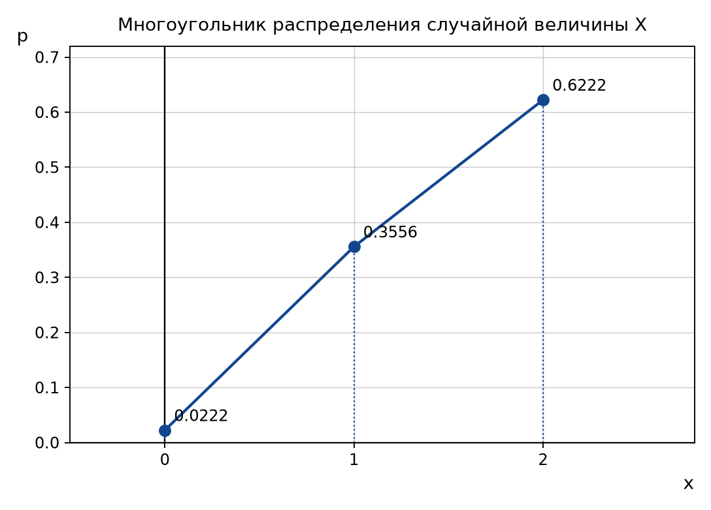
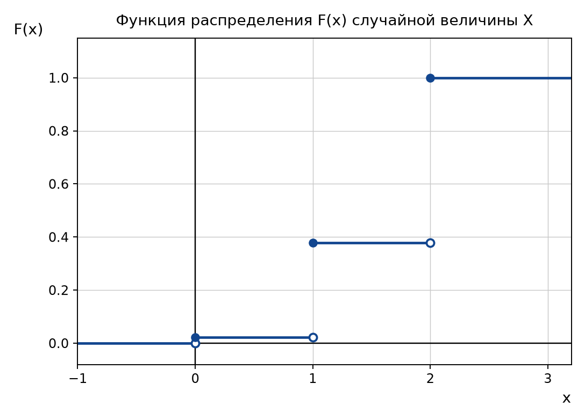
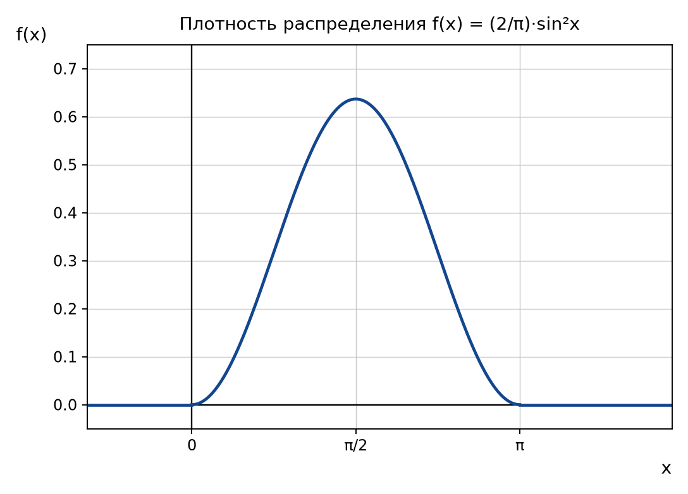
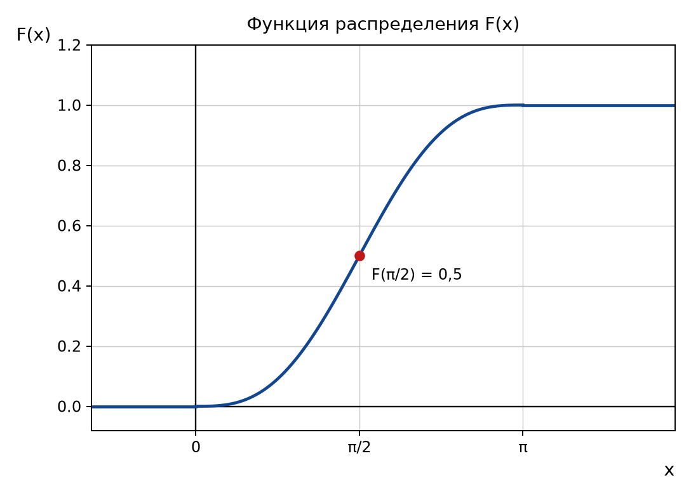
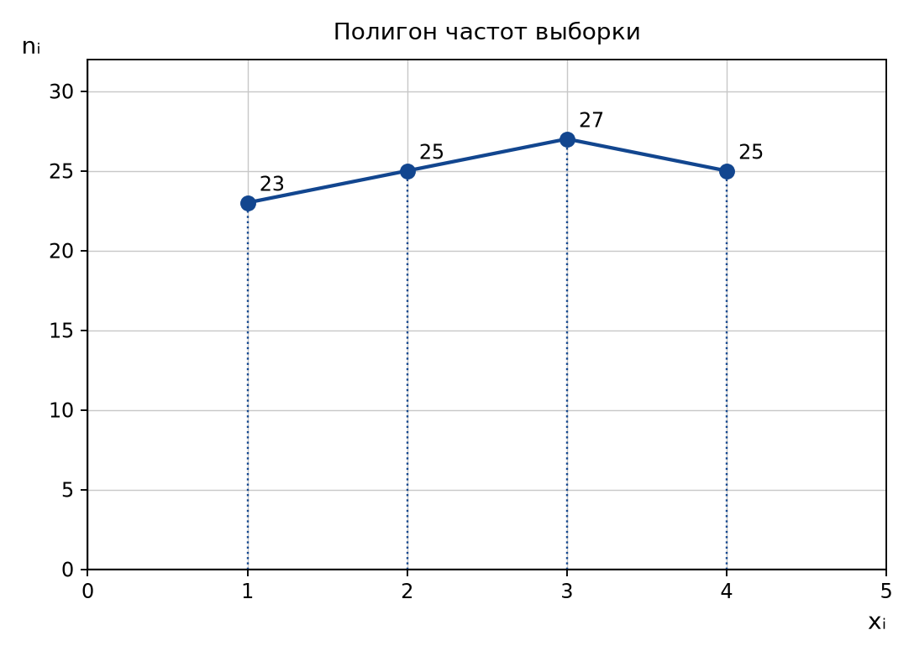

# Контрольная работа по дисциплине «Теория вероятностей и математическая статистика»

## Вариант 8

## Задача 1

**Условие.** Студент разыскивает нужную ему формулу в трёх справочниках. Вероятность того, что формула содержится в первом, втором, третьем справочниках, равна 0,6; 0,7; 0,8. Найти вероятность того, что формула содержится: только в одном справочнике; хотя бы в одном справочнике.

**Решение.** Обозначим события: $A_{1}$ — формула есть в первом справочнике, $A_{2}$ — во втором, $A_{3}$ — в третьем. По условию

$$P(A_{1})=p_{1}=0{,}6,\qquad P(A_{2})=p_{2}=0{,}7,\qquad P(A_{3})=p_{3}=0{,}8.$$

Вероятности противоположных событий $\overline{A_{i}}$ (формулы в справочнике нет) находим по формуле $P(\overline{A})=1-P(A)$:

$$q_{1}=1-0{,}6=0{,}4,\qquad q_{2}=1-0{,}7=0{,}3,\qquad q_{3}=1-0{,}8=0{,}2.$$

События $A_{1}$, $A_{2}$, $A_{3}$ независимы в совокупности, поэтому вероятность произведения событий равна произведению их вероятностей.

**1) Формула содержится только в одном справочнике.** Событие $B$ наступает в трёх несовместных случаях: формула есть только в первом справочнике, только во втором или только в третьем. По теореме сложения вероятностей несовместных событий и теореме умножения независимых событий:

$$P(B)=p_{1}q_{2}q_{3}+q_{1}p_{2}q_{3}+q_{1}q_{2}p_{3}.$$

$$P(B)=0{,}6\cdot 0{,}3\cdot 0{,}2+0{,}4\cdot 0{,}7\cdot 0{,}2+0{,}4\cdot 0{,}3\cdot 0{,}8=0{,}036+0{,}056+0{,}096=0{,}188.$$

**2) Формула содержится хотя бы в одном справочнике.** Удобнее перейти к противоположному событию $\overline{C}$ — формулы нет ни в одном из справочников:

$$P(\overline{C})=q_{1}q_{2}q_{3}=0{,}4\cdot 0{,}3\cdot 0{,}2=0{,}024.$$

$$P(C)=1-P(\overline{C})=1-0{,}024=0{,}976.$$

**Ответ:** вероятность того, что формула содержится только в одном справочнике, равна $0{,}188$; хотя бы в одном справочнике — $0{,}976$.

## Задача 2

**Условие.** В одном из районов республики 24 человека обучаются на заочном отделении института. Известно, что 6 человек обучаются на юридическом факультете, 12 человек — на экономическом и 6 человек — на налоговом факультете. Вероятность успешной сдачи экзамена студентами юрфака равна 0,6; для экономического факультета 0,76; для студентов налогового факультета 0,8. Найти вероятность того, что наудачу выбранный студент, успешно сдавший все экзамены, — будущий «налоговик».

**Решение.** Рассмотрим гипотезы о том, на каком факультете учится наудачу выбранный студент:

- $H_{1}$ — студент юридического факультета;
- $H_{2}$ — студент экономического факультета;
- $H_{3}$ — студент налогового факультета.

Вероятности гипотез находим как отношение числа студентов факультета к общему числу студентов (классическое определение вероятности):

$$P(H_{1})=\frac{6}{24}=0{,}25,\qquad P(H_{2})=\frac{12}{24}=0{,}5,\qquad P(H_{3})=\frac{6}{24}=0{,}25.$$

Проверка: $0{,}25+0{,}5+0{,}25=1$, гипотезы образуют полную группу событий.

Пусть событие $A$ — студент успешно сдал все экзамены. Условные вероятности даны в условии:

$$P(A\mid H_{1})=0{,}6,\qquad P(A\mid H_{2})=0{,}76,\qquad P(A\mid H_{3})=0{,}8.$$

По **формуле полной вероятности**

$$P(A)=\sum_{i=1}^{3}P(H_{i})\,P(A\mid H_{i})=0{,}25\cdot 0{,}6+0{,}5\cdot 0{,}76+0{,}25\cdot 0{,}8;$$

$$P(A)=0{,}15+0{,}38+0{,}2=0{,}73.$$

Требуется вероятность того, что успешно сдавший экзамены студент учится на налоговом факультете, то есть условная вероятность $P(H_{3}\mid A)$. Её находим по **формуле Байеса**:

$$P(H_{3}\mid A)=\frac{P(H_{3})\,P(A\mid H_{3})}{P(A)}=\frac{0{,}25\cdot 0{,}8}{0{,}73}=\frac{0{,}2}{0{,}73}=\frac{20}{73}\approx 0{,}274.$$

**Ответ:** $P(H_{3}\mid A)=\dfrac{20}{73}\approx 0{,}274$.

## Задача 3

**Условие.** В партии из 10 деталей имеется 8 стандартных. Из этой партии наудачу взято две детали. Найти закон распределения случайной величины $X$, равной числу стандартных изделий в выборке. Записать ряд распределения, построить многоугольник распределения, функцию распределения.

**Решение.** Случайная величина $X$ — число стандартных деталей среди двух отобранных — принимает значения $0$, $1$, $2$. Так как детали отбираются без возвращения из партии, содержащей $N=10$ деталей, из которых $M=8$ стандартных, величина $X$ распределена по **гипергеометрическому закону**:

$$P(X=k)=\frac{C_{M}^{k}\cdot C_{N-M}^{\,n-k}}{C_{N}^{\,n}},\qquad k=0,1,2.$$

Общее число способов выбрать две детали из десяти:

$$C_{10}^{2}=\frac{10!}{2!\,8!}=\frac{10\cdot 9}{2}=45.$$

Вычисляем вероятности:

$$P(X=0)=\frac{C_{8}^{0}C_{2}^{2}}{C_{10}^{2}}=\frac{1\cdot 1}{45}=\frac{1}{45}\approx 0{,}0222;$$

$$P(X=1)=\frac{C_{8}^{1}C_{2}^{1}}{C_{10}^{2}}=\frac{8\cdot 2}{45}=\frac{16}{45}\approx 0{,}3556;$$

$$P(X=2)=\frac{C_{8}^{2}C_{2}^{0}}{C_{10}^{2}}=\frac{28\cdot 1}{45}=\frac{28}{45}\approx 0{,}6222.$$

Контроль: $\dfrac{1}{45}+\dfrac{16}{45}+\dfrac{28}{45}=\dfrac{45}{45}=1$ — сумма вероятностей равна единице, значит вычисления верны.

**Ряд распределения:**

| $x_{i}$ | 0 | 1 | 2 |
|---|---|---|---|
| $p_{i}$ | 1/45 ≈ 0,0222 | 16/45 ≈ 0,3556 | 28/45 ≈ 0,6222 |

**Многоугольник распределения** получается, если точки $(x_{i};p_{i})$ соединить отрезками.

**Функция распределения** $F(x)=P(X<x)$ вычисляется накоплением вероятностей:

$$F(x)=\begin{cases}0, & x\leq 0;\\[4pt] \dfrac{1}{45}\approx 0{,}022, & 0<x\leq 1;\\[6pt] \dfrac{1}{45}+\dfrac{16}{45}=\dfrac{17}{45}\approx 0{,}378, & 1<x\leq 2;\\[6pt] 1, & x>2.\end{cases}$$

График функции распределения — ступенчатая линия со скачками в точках $x=0$, $x=1$, $x=2$; величина каждого скачка равна соответствующей вероятности $p_{i}$.

Дополнительно найдём математическое ожидание как проверку:

$$M[X]=\sum x_{i}p_{i}=0\cdot\frac{1}{45}+1\cdot\frac{16}{45}+2\cdot\frac{28}{45}=\frac{72}{45}=1{,}6.$$

Результат согласуется с общей формулой для гипергеометрического распределения $M[X]=n\cdot\dfrac{M}{N}=2\cdot\dfrac{8}{10}=1{,}6$.

**Ответ:** ряд распределения приведён выше; $F(x)$ — ступенчатая функция со скачками $\dfrac{1}{45}$, $\dfrac{16}{45}$, $\dfrac{28}{45}$ в точках 0, 1, 2.

## Задача 4

**Условие.** Непрерывная случайная величина $X$ задана функцией распределения

$$F(x)=\begin{cases}0, & x<0;\\[4pt] A\left(x-\dfrac{1}{2}\sin 2x\right), & 0\leq x\leq\pi;\\[6pt] 1, & x>\pi.\end{cases}$$

Найти: параметр $A$; функцию плотности распределения $f(x)$; математическое ожидание $M[X]$ и дисперсию $D[X]$; вероятность события $P\left(0\leq X\leq\dfrac{\pi}{2}\right)$.

**Решение.**

**1) Параметр A.** Функция распределения непрерывной случайной величины непрерывна, поэтому в точке $x=\pi$ значения «среднего» и «верхнего» выражений совпадают:

$$A\left(\pi-\frac{1}{2}\sin 2\pi\right)=1.$$

Так как $\sin 2\pi=0$, получаем $A\pi=1$, откуда

$$A=\frac{1}{\pi}.$$

**2) Плотность распределения.** Плотность есть производная функции распределения: $f(x)=F'(x)$. На отрезке $[0;\pi]$

$$f(x)=\frac{1}{\pi}\left(x-\frac{1}{2}\sin 2x\right)'=\frac{1}{\pi}\left(1-\cos 2x\right).$$

Используя формулу понижения степени $1-\cos 2x=2\sin^{2}x$, запишем плотность в более удобном виде:

$$f(x)=\begin{cases}\dfrac{2}{\pi}\sin^{2}x, & 0\leq x\leq\pi;\\[6pt] 0, & x<0\ \text{или}\ x>\pi.\end{cases}$$

**3) Математическое ожидание.** По определению для непрерывной случайной величины

$$M[X]=\int\limits_{-\infty}^{+\infty}x f(x)\,dx=\frac{1}{\pi}\int\limits_{0}^{\pi}x\left(1-\cos 2x\right)dx=\frac{1}{\pi}\left(\int\limits_{0}^{\pi}x\,dx-\int\limits_{0}^{\pi}x\cos 2x\,dx\right).$$

Первый интеграл: $\displaystyle\int\limits_{0}^{\pi}x\,dx=\left.\frac{x^{2}}{2}\right|_{0}^{\pi}=\frac{\pi^{2}}{2}$.

Второй интеграл берём по частям ($u=x$, $dv=\cos 2x\,dx$, $du=dx$, $v=\dfrac{\sin 2x}{2}$):

$$\int\limits_{0}^{\pi}x\cos 2x\,dx=\left.\frac{x\sin 2x}{2}\right|_{0}^{\pi}-\frac{1}{2}\int\limits_{0}^{\pi}\sin 2x\,dx=0+\left.\frac{\cos 2x}{4}\right|_{0}^{\pi}=\frac{1}{4}-\frac{1}{4}=0.$$

Следовательно,

$$M[X]=\frac{1}{\pi}\cdot\frac{\pi^{2}}{2}=\frac{\pi}{2}\approx 1{,}571.$$

Результат ожидаем: плотность симметрична относительно прямой $x=\dfrac{\pi}{2}$, поэтому математическое ожидание совпадает с центром симметрии.

**4) Дисперсия.** Воспользуемся формулой $D[X]=M[X^{2}]-\left(M[X]\right)^{2}$. Вычислим второй начальный момент:

$$M[X^{2}]=\frac{1}{\pi}\int\limits_{0}^{\pi}x^{2}\left(1-\cos 2x\right)dx=\frac{1}{\pi}\left(\frac{\pi^{3}}{3}-\int\limits_{0}^{\pi}x^{2}\cos 2x\,dx\right).$$

Интеграл $\displaystyle\int\limits_{0}^{\pi}x^{2}\cos 2x\,dx$ находим двукратным интегрированием по частям:

$$\int x^{2}\cos 2x\,dx=\frac{x^{2}\sin 2x}{2}+\frac{x\cos 2x}{2}-\frac{\sin 2x}{4}.$$

Подставляя пределы, получаем

$$\int\limits_{0}^{\pi}x^{2}\cos 2x\,dx=\left(0+\frac{\pi}{2}-0\right)-\left(0+0-0\right)=\frac{\pi}{2}.$$

Тогда

$$M[X^{2}]=\frac{1}{\pi}\left(\frac{\pi^{3}}{3}-\frac{\pi}{2}\right)=\frac{\pi^{2}}{3}-\frac{1}{2},$$

$$D[X]=\frac{\pi^{2}}{3}-\frac{1}{2}-\frac{\pi^{2}}{4}=\frac{\pi^{2}}{12}-\frac{1}{2}\approx 0{,}822-0{,}5=0{,}322.$$

Среднее квадратическое отклонение: $\sigma=\sqrt{D[X]}\approx\sqrt{0{,}322}\approx 0{,}568$.

**5) Вероятность попадания в интервал.** Для непрерывной случайной величины

$$P(\alpha\leq X\leq\beta)=F(\beta)-F(\alpha).$$

$$P\left(0\leq X\leq\frac{\pi}{2}\right)=F\left(\frac{\pi}{2}\right)-F(0)=\frac{1}{\pi}\left(\frac{\pi}{2}-\frac{1}{2}\sin\pi\right)-0=\frac{1}{\pi}\cdot\frac{\pi}{2}=0{,}5.$$

Это также следует из симметрии плотности относительно $x=\dfrac{\pi}{2}$.

**Ответ:** $A=\dfrac{1}{\pi}$; $f(x)=\dfrac{2}{\pi}\sin^{2}x$ на $[0;\pi]$ и $f(x)=0$ вне этого отрезка; $M[X]=\dfrac{\pi}{2}\approx 1{,}571$; $D[X]=\dfrac{\pi^{2}}{12}-\dfrac{1}{2}\approx 0{,}322$; $P\left(0\leq X\leq\dfrac{\pi}{2}\right)=0{,}5$.

## Задача 5

**Условие.** Случайная величина $X$ распределена по нормальному закону с математическим ожиданием $M[X]=10$, среднее квадратическое отклонение $\sigma=5$. Найти симметричный интервал относительно математического ожидания, в который попадёт измеренное значение с вероятностью 0,9544.

**Решение.** Вероятность попадания нормально распределённой случайной величины в интервал, симметричный относительно математического ожидания $a$, вычисляется по формуле

$$P\left(|X-a|<\varepsilon\right)=2\Phi\!\left(\frac{\varepsilon}{\sigma}\right),$$

где $\Phi(t)=\dfrac{1}{\sqrt{2\pi}}\displaystyle\int\limits_{0}^{t}e^{-\frac{z^{2}}{2}}dz$ — функция Лапласа.

По условию $2\Phi\!\left(\dfrac{\varepsilon}{\sigma}\right)=0{,}9544$, отсюда

$$\Phi\!\left(\frac{\varepsilon}{\sigma}\right)=0{,}4772.$$

По таблице значений функции Лапласа находим аргумент, которому соответствует значение 0,4772:

$$\frac{\varepsilon}{\sigma}=2\ \Rightarrow\ \varepsilon=2\sigma=2\cdot 5=10.$$

Искомый интервал:

$$\left(a-\varepsilon;\ a+\varepsilon\right)=\left(10-10;\ 10+10\right)=(0;\ 20).$$

Полученный результат — частный случай **правила «двух сигм»**: в интервал $a\pm 2\sigma$ случайная величина попадает с вероятностью 0,9544.

**Ответ:** интервал $(0;\ 20)$, то есть $|X-10|<10$.

## Задача 6

**Условие.** Какова вероятность того, что из 100 наугад отобранных монет, расположенных в виде столбика, число монет, лежащих «гербом» вверх, будет от 45 до 55?

**Решение.** Для каждой монеты вероятность выпадения «герба» равна $p=0{,}5$, соответственно $q=1-p=0{,}5$. Число испытаний $n=100$ велико, поэтому применим **интегральную теорему Муавра — Лапласа**:

$$P\left(k_{1}\leq k\leq k_{2}\right)\approx\Phi(x_{2})-\Phi(x_{1}),\qquad x_{i}=\frac{k_{i}-np}{\sqrt{npq}}.$$

Вычислим параметры:

$$np=100\cdot 0{,}5=50,\qquad \sqrt{npq}=\sqrt{100\cdot 0{,}5\cdot 0{,}5}=\sqrt{25}=5.$$

Нормируем границы:

$$x_{1}=\frac{45-50}{5}=-1,\qquad x_{2}=\frac{55-50}{5}=1.$$

Так как функция Лапласа нечётна, $\Phi(-1)=-\Phi(1)$, и по таблице $\Phi(1)=0{,}3413$:

$$P(45\leq k\leq 55)\approx\Phi(1)-\Phi(-1)=2\Phi(1)=2\cdot 0{,}3413=0{,}6826.$$

**Ответ:** $P\approx 0{,}683$.

## Задача 7

**Условие.** Из генеральной совокупности извлечена выборка с вариантами $x_{i}$ и частотами $n_{i}$. Найти статистические характеристики выборки: объём выборки, выборочную среднюю, выборочную дисперсию и выборочный стандарт.

| $x_{i}$ | 1 | 2 | 3 | 4 |
|---|---|---|---|---|
| $n_{i}$ | 23 | 25 | 27 | 25 |

**Решение.**

**1) Объём выборки** равен сумме всех частот:

$$n=\sum n_{i}=23+25+27+25=100.$$

**2) Выборочная средняя** вычисляется по формуле

$$\overline{x}_{в}=\frac{1}{n}\sum x_{i}n_{i}=\frac{1\cdot 23+2\cdot 25+3\cdot 27+4\cdot 25}{100}=\frac{23+50+81+100}{100}=\frac{254}{100}=2{,}54.$$

**3) Выборочная дисперсия.** Удобно использовать формулу

$$D_{в}=\overline{x^{2}}-\left(\overline{x}_{в}\right)^{2},\qquad \overline{x^{2}}=\frac{1}{n}\sum x_{i}^{2}n_{i}.$$

Вычислим второй момент:

$$\overline{x^{2}}=\frac{1^{2}\cdot 23+2^{2}\cdot 25+3^{2}\cdot 27+4^{2}\cdot 25}{100}=\frac{23+100+243+400}{100}=\frac{766}{100}=7{,}66.$$

Тогда

$$D_{в}=7{,}66-2{,}54^{2}=7{,}66-6{,}4516=1{,}2084.$$

**4) Выборочный стандарт** (выборочное среднее квадратическое отклонение):

$$\sigma_{в}=\sqrt{D_{в}}=\sqrt{1{,}2084}\approx 1{,}099.$$

Если требуется несмещённая оценка генеральной дисперсии, используют исправленную дисперсию:

$$s^{2}=\frac{n}{n-1}D_{в}=\frac{100}{99}\cdot 1{,}2084\approx 1{,}221,\qquad s\approx 1{,}105.$$

**Ответ:** $n=100$; $\overline{x}_{в}=2{,}54$; $D_{в}=1{,}2084$; $\sigma_{в}\approx 1{,}099$ (исправленная дисперсия $s^{2}\approx 1{,}221$, $s\approx 1{,}105$).

## Список использованной литературы

1. Гмурман В. Е. Теория вероятностей и математическая статистика: учебное пособие для вузов. — 12-е изд. — М.: Юрайт, 2023. — 479 с.
2. Гмурман В. Е. Руководство к решению задач по теории вероятностей и математической статистике: учебное пособие. — М.: Юрайт, 2022. — 406 с.
3. Кремер Н. Ш. Теория вероятностей и математическая статистика: учебник и практикум для вузов. — 5-е изд. — М.: Юрайт, 2024. — 538 с.
4. Вентцель Е. С. Теория вероятностей: учебник. — М.: КноРус, 2021. — 658 с.
5. Письменный Д. Т. Конспект лекций по теории вероятностей, математической статистике и случайным процессам. — М.: Айрис-пресс, 2022. — 288 с.
